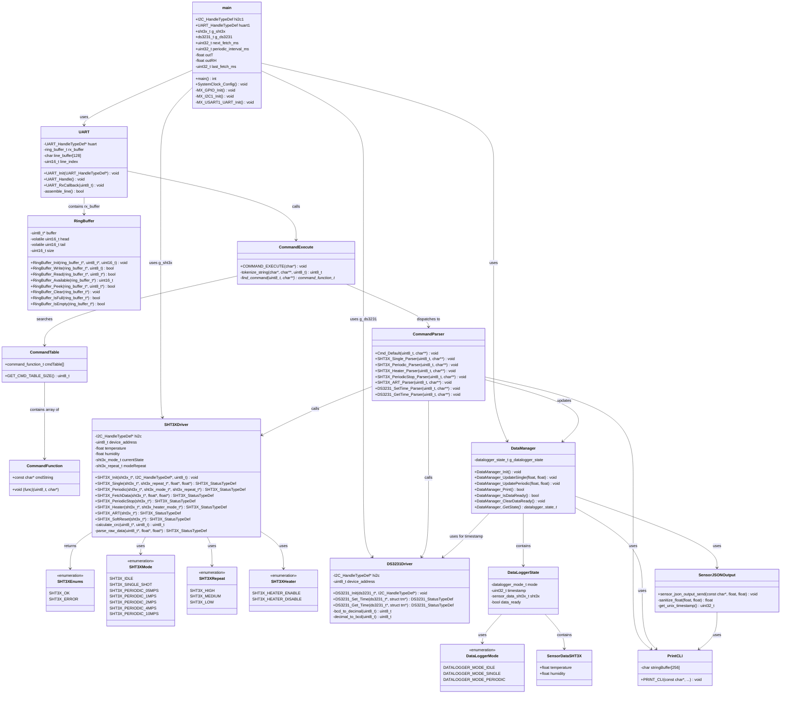
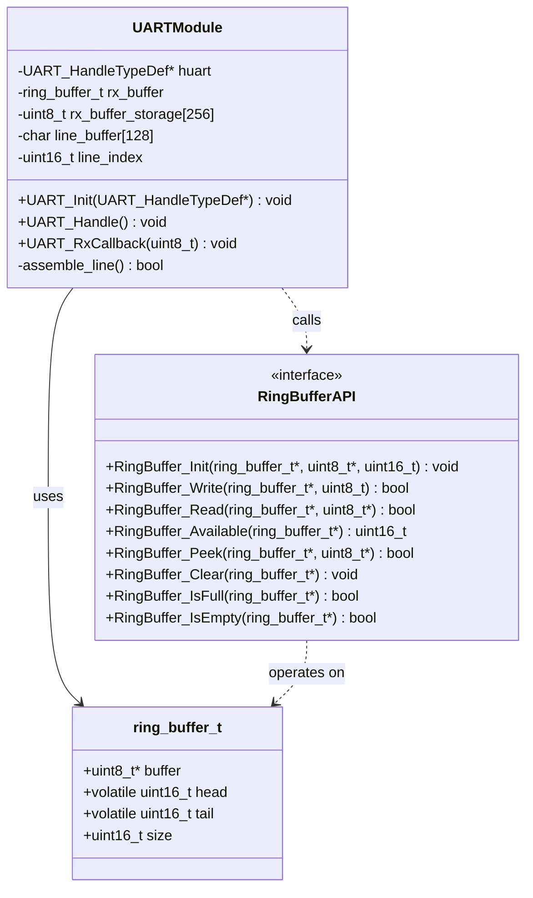
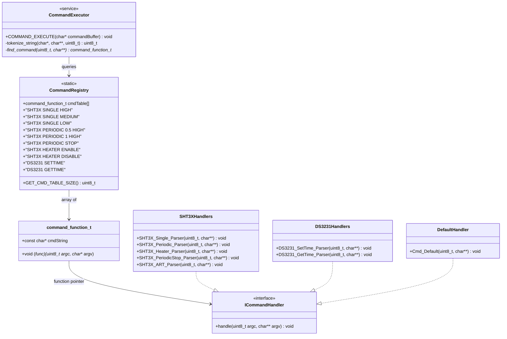
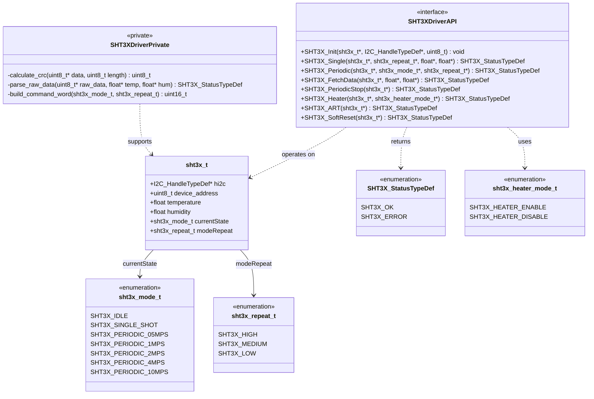
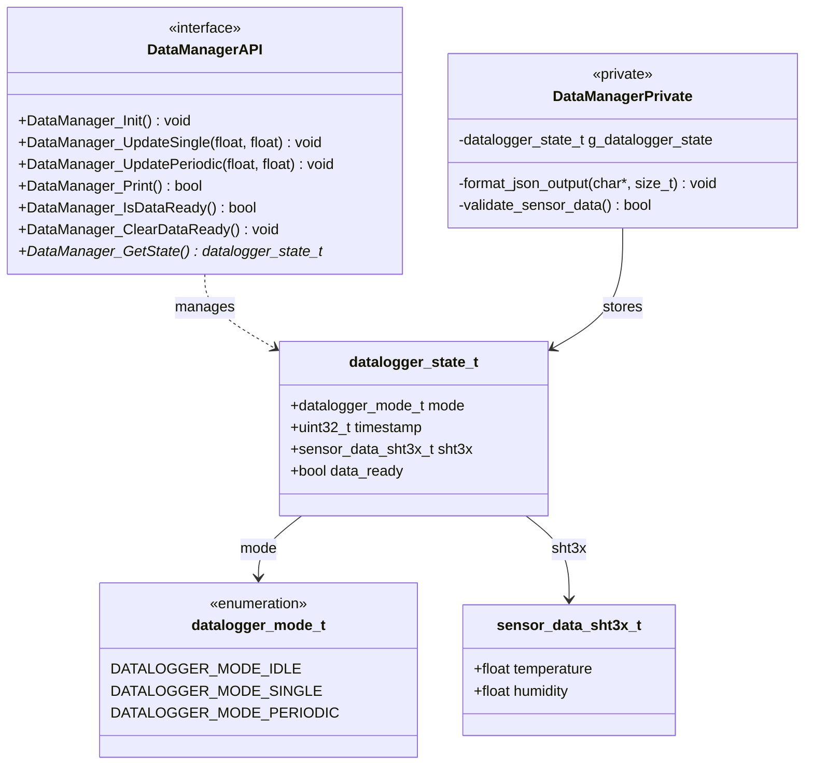
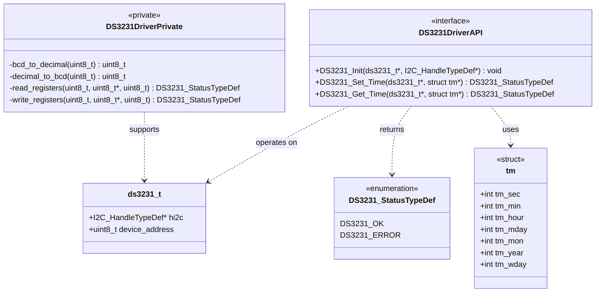
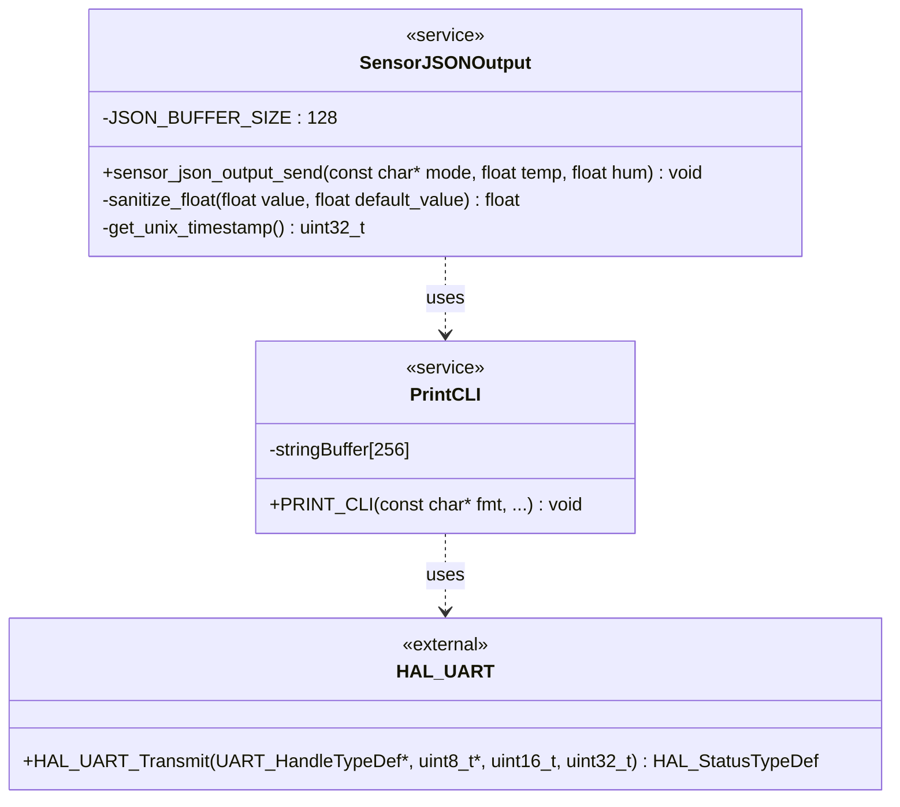
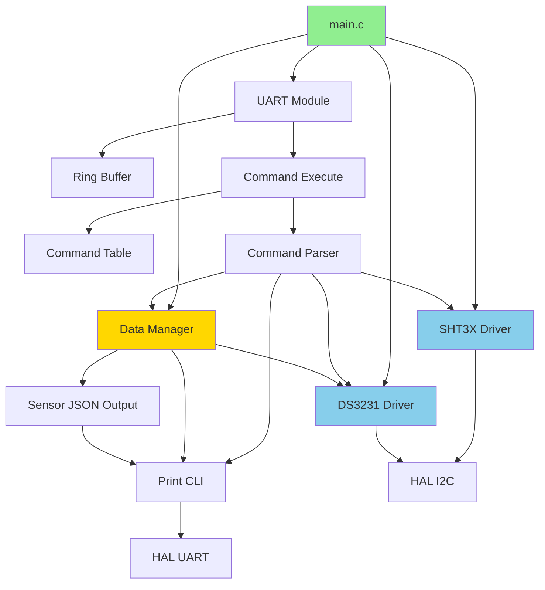
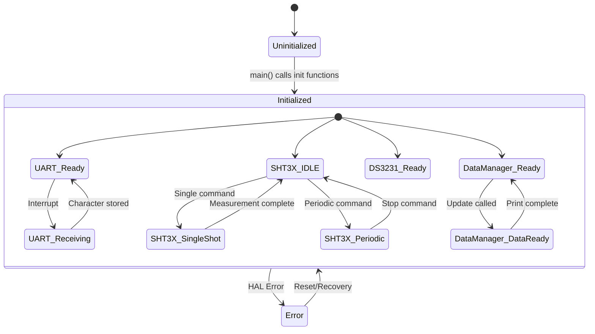

# STM32 Data Logger - UML Class Diagram

This document provides the UML class diagrams showing the structure and relationships of the STM32 firmware components.

## Complete System Class Diagram

## Core Component Details

### UART and Ring Buffer Component

### Command Processing Component

### SHT3X Sensor Driver Component

### Data Manager Component

### DS3231 RTC Driver Component

### Output and Formatting Component

## Component Dependencies

## Object Lifecycle Diagram

---

**Key Design Patterns:**

1. **Service Locator**: Command table acts as a registry of command handlers
2. **Strategy Pattern**: Different command parsers implement different handling strategies
3. **State Pattern**: SHT3X driver maintains state (IDLE, SINGLE_SHOT, PERIODIC_*)
4. **Singleton**: DataManager uses static internal state (g_datalogger_state)
5. **Observer**: UART interrupt observes hardware and notifies ring buffer
6. **Producer-Consumer**: Ring buffer mediates between interrupt (producer) and main loop (consumer)

**Key Relationships:**

- **Composition** (solid diamond): UART contains ring_buffer_t
- **Association** (solid line): main uses SHT3X driver
- **Dependency** (dashed line): Parser depends on Driver
- **Realization** (dashed line with triangle): Handlers implement ICommandHandler
