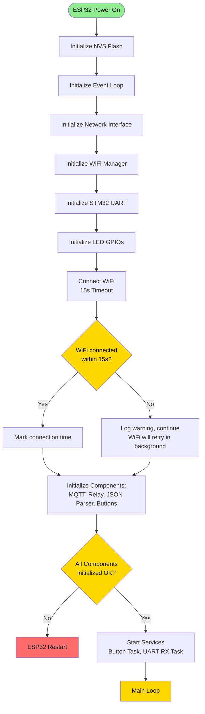
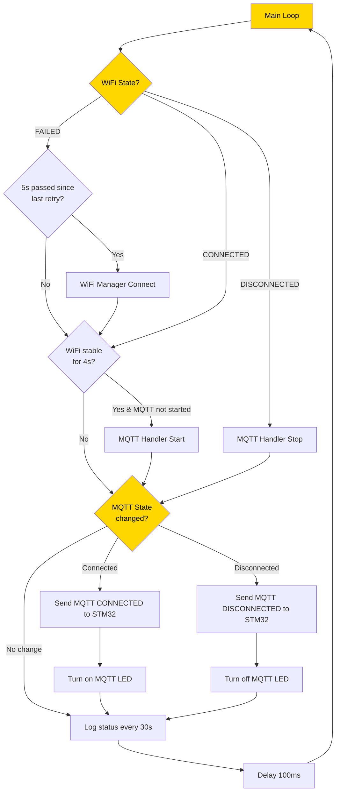
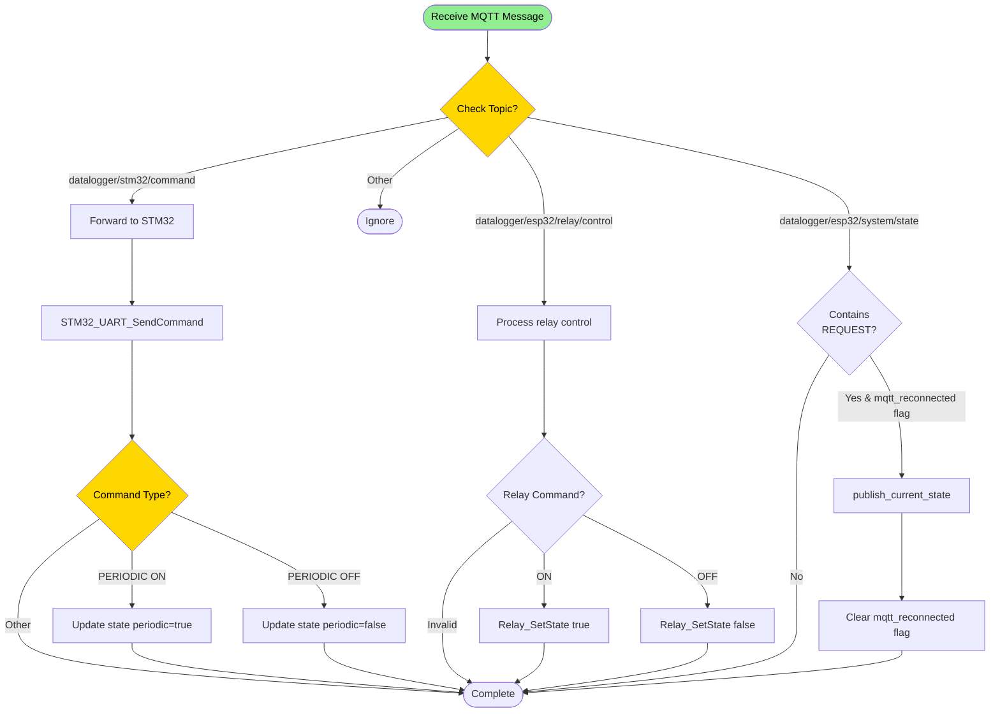
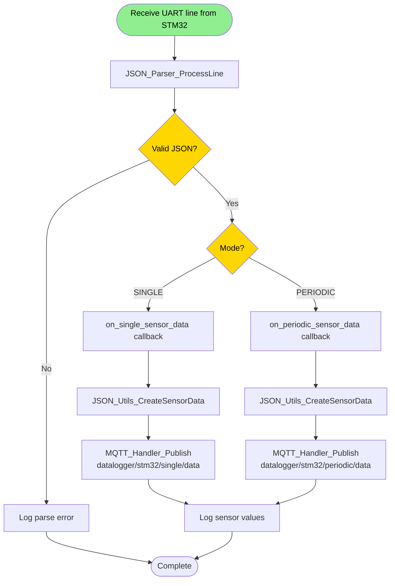
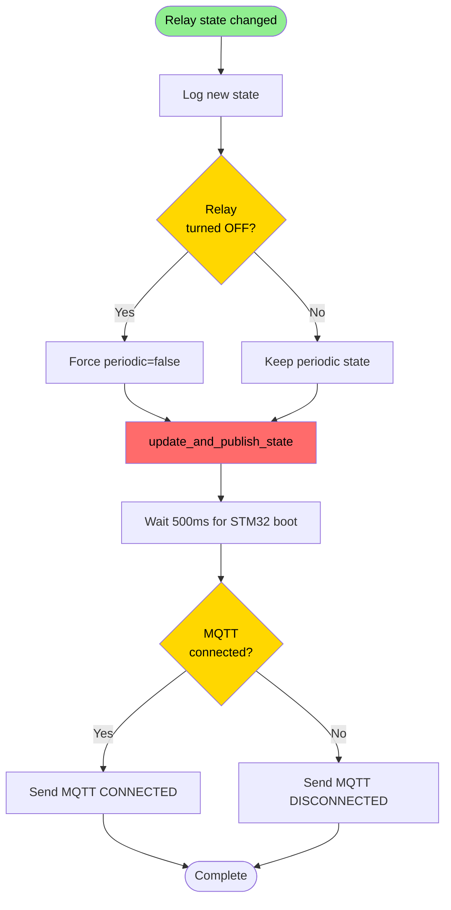
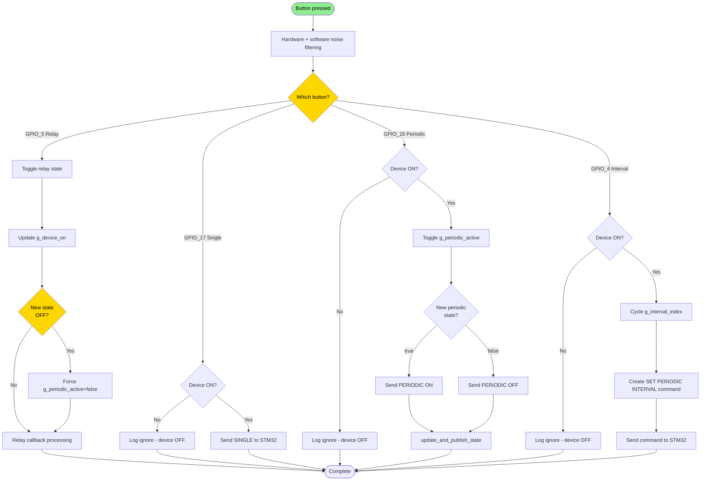
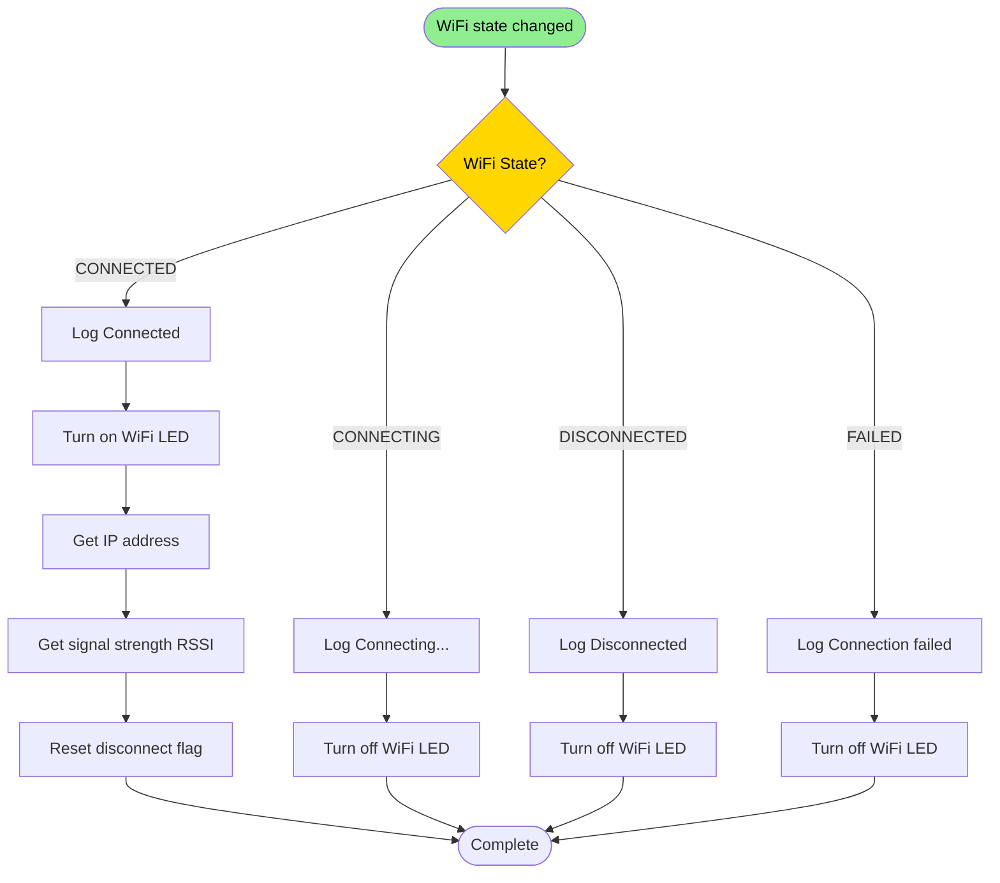
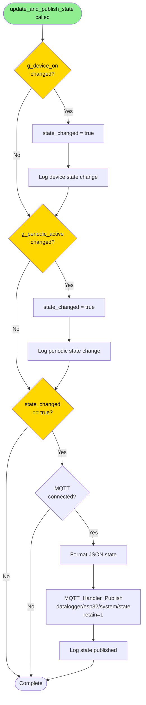
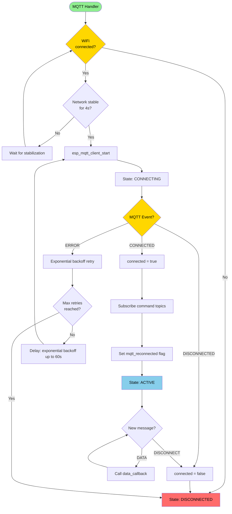
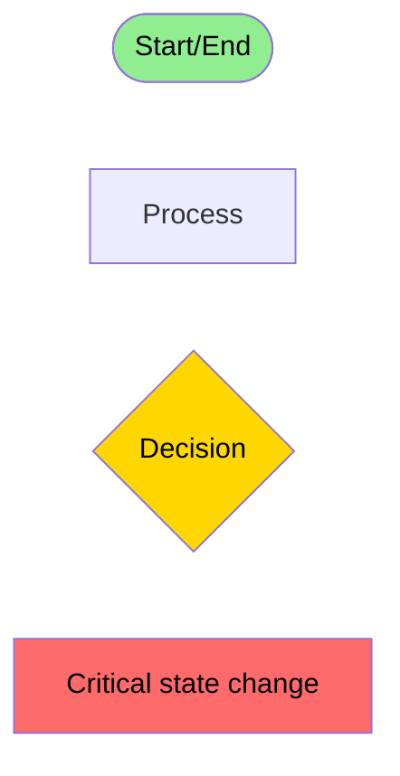

# ESP32 Firmware - Flow Diagrams

This document describes the operational flows and control logic within the ESP32 firmware.

## System Startup Flow

## Main Loop Flow

## MQTT Message Processing Flow

## STM32 Data Processing Flow

## Relay State Change Flow

## Button Press Processing Flow

## WiFi State Change Flow

## State Update and Publish Flow

## MQTT Connection State Machine

## Legend

---

**Important Notes:**

- **Green nodes**: Start/end points
- **Yellow nodes**: Decision points
- **Red nodes**: Critical state changes
- **Blue nodes**: Active/stable states

**Flow processing characteristics:**

- WiFi manager auto-retry (5 times with 2s interval)
- MQTT starts only after WiFi is stable for 4s
- All button actions require device (relay) to be ON (except relay toggle)
- Relay state change triggers 500ms delay before sending MQTT status to STM32 (for STM32 boot)
- Exponential backoff for MQTT retry (min 1s, max 60s)
- State synchronization via MQTT retained messages
