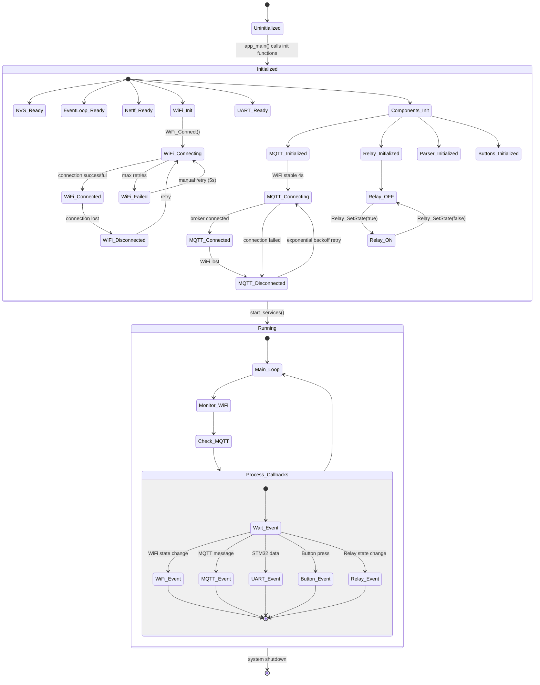
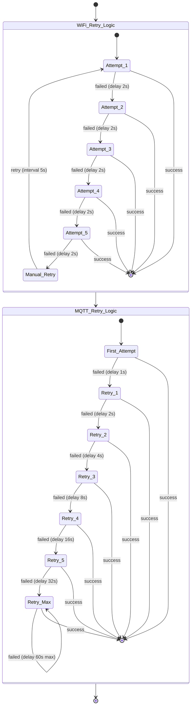
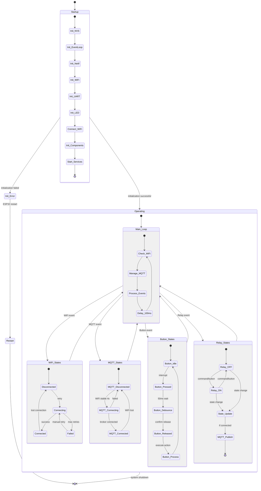

# ESP32 Firmware - UML Class Diagrams

This document provides UML class diagrams showing the structure and relationships of components within the ESP32 firmware.

## Overall System Class Diagram

```mermaid
classDiagram
    class main {
        +wifi_manager_t g_wifi_manager
        +stm32_uart_t g_stm32_uart
        +mqtt_handler_t g_mqtt_handler
        +relay_control_t g_relay
        +json_sensor_parser_t g_json_parser
        +bool g_device_on
        +bool g_periodic_active
        +bool mqtt_current_state
        +uint8_t g_interval_index
        +bool mqtt_reconnected
        +int64_t wifi_reconnect_time_us
        +app_main() void
        +initialize_components() void
        +start_services() void
        +create_state_message(char*, size_t) int
        +publish_current_state() void
        +update_and_publish_state(bool, bool) void
        +on_wifi_event(wifi_state_t, void*) void
        +on_stm32_data_received(const char*) void
        +on_mqtt_data_received(const char*, const char*, int) void
        +on_single_sensor_data(const sensor_data_t*) void
        +on_periodic_sensor_data(const sensor_data_t*) void
        +on_relay_state_changed(bool) void
        +on_button_relay_pressed(gpio_num_t) void
        +on_button_single_pressed(gpio_num_t) void
        +on_button_periodic_pressed(gpio_num_t) void
        +on_button_interval_pressed(gpio_num_t) void
    }

    class WiFiManager {
        -wifi_state_t current_state
        -uint8_t retry_count
        -wifi_event_callback_t callback
        -void* callback_arg
        +WiFi_Init(wifi_manager_config_t*) bool
        +WiFi_Connect() bool
        +WiFi_Disconnect() bool
        +WiFi_GetState() wifi_state_t
        +WiFi_IsConnected() bool
        +WiFi_GetIPInfo(esp_netif_ip_info_t*) bool
        +WiFi_GetRSSI(int8_t*) bool
        +WiFi_GetStateString(wifi_state_t) const char*
        +WiFi_SetPowerSave(bool) bool
        +WiFi_Deinit() void
    }

    class wifi_manager_config_t {
        +const char* ssid
        +const char* password
        +uint8_t maximum_retry
        +uint8_t scan_method
        +uint8_t sort_method
        +int8_t rssi_threshold
        +wifi_auth_mode_t auth_mode_threshold
        +uint16_t listen_interval
        +bool power_save_enabled
        +wifi_ps_type_t power_save_mode
        +bool ipv6_enabled
        +uint32_t connection_timeout_ms
        +wifi_event_callback_t event_callback
        +void* callback_arg
    }

    class wifi_state_t {
        <<enumeration>>
        WIFI_STATE_DISCONNECTED
        WIFI_STATE_CONNECTING
        WIFI_STATE_CONNECTED
        WIFI_STATE_FAILED
    }

    class STM32_UART {
        -int uart_num
        -int baud_rate
        -int tx_pin
        -int rx_pin
        -ring_buffer_t rx_buffer
        -stm32_data_callback_t data_callback
        -bool initialized
        +STM32_UART_Init(stm32_uart_t*, int, int, int, int, stm32_data_callback_t) bool
        +STM32_UART_SendCommand(stm32_uart_t*, const char*) bool
        +STM32_UART_ProcessData(stm32_uart_t*) void
        +STM32_UART_StartTask(stm32_uart_t*) bool
        +STM32_UART_Deinit(stm32_uart_t*) void
    }

    class RingBuffer {
        -uint8_t* buffer
        -size_t size
        -size_t head
        -size_t tail
        -size_t count
        +RingBuffer_Init(ring_buffer_t*, size_t) bool
        +RingBuffer_Write(ring_buffer_t*, const uint8_t*, size_t) bool
        +RingBuffer_Read(ring_buffer_t*, uint8_t*, size_t) size_t
        +RingBuffer_Available(ring_buffer_t*) size_t
        +RingBuffer_IsFull(ring_buffer_t*) bool
        +RingBuffer_IsEmpty(ring_buffer_t*) bool
        +RingBuffer_Clear(ring_buffer_t*) void
        +RingBuffer_Free(ring_buffer_t*) void
    }

    class MQTT_Handler {
        -esp_mqtt_client_handle_t client
        -mqtt_data_callback_t callback
        -bool connected
        -int retry_count
        +MQTT_Handler_Init(mqtt_handler_t*, const char*, const char*, const char*, const char*, mqtt_data_callback_t) bool
        +MQTT_Handler_Start(mqtt_handler_t*) bool
        +MQTT_Handler_Stop(mqtt_handler_t*) bool
        +MQTT_Handler_Subscribe(mqtt_handler_t*, const char*, int) bool
        +MQTT_Handler_Publish(mqtt_handler_t*, const char*, const char*, int, bool) bool
        +MQTT_Handler_IsConnected(mqtt_handler_t*) bool
        +MQTT_Handler_Deinit(mqtt_handler_t*) void
    }

    class Relay_Control {
        -int gpio_num
        -bool state
        -bool initialized
        -relay_state_callback_t state_callback
        +Relay_Init(relay_control_t*, int, relay_state_callback_t) bool
        +Relay_SetState(relay_control_t*, bool) bool
        +Relay_GetState(relay_control_t*) bool
        +Relay_Toggle(relay_control_t*) bool
        +Relay_ProcessCommand(relay_control_t*, const char*) bool
        +Relay_Deinit(relay_control_t*) void
    }

    class JSON_Sensor_Parser {
        -sensor_data_callback_t single_callback
        -sensor_data_callback_t periodic_callback
        -sensor_data_callback_t error_callback
        +JSON_Parser_Init(json_sensor_parser_t*, sensor_data_callback_t, sensor_data_callback_t, sensor_data_callback_t) bool
        +JSON_Parser_ParseLine(json_sensor_parser_t*, const char*) sensor_data_t
        +JSON_Parser_ProcessLine(json_sensor_parser_t*, const char*) bool
        +JSON_Parser_GetMode(const char*) sensor_mode_t
        +JSON_Parser_GetModeString(sensor_mode_t) const char*
        +JSON_Parser_IsValid(const sensor_data_t*) bool
        +JSON_Parser_IsSensorFailed(const sensor_data_t*) bool
        +JSON_Parser_IsRTCFailed(const sensor_data_t*) bool
    }

    class sensor_data_t {
        +sensor_mode_t mode
        +uint32_t timestamp
        +bool valid
        +bool has_temperature
        +float temperature
        +bool has_humidity
        +float humidity
    }

    class sensor_mode_t {
        <<enumeration>>
        SENSOR_MODE_UNKNOWN
        SENSOR_MODE_SINGLE
        SENSOR_MODE_PERIODIC
    }

    class JSON_Utils {
        <<static>>
        +JSON_Utils_CreateSensorData(char*, size_t, const char*, uint32_t, float, float) int
        +JSON_Utils_CreateSystemState(char*, size_t, bool, bool, uint64_t) int
        +JSON_Utils_CreateSimpleMessage(char*, size_t, const char*, const char*) int
        +JSON_Utils_CreateIntMessage(char*, size_t, const char*, int) int
        +JSON_Utils_FormatFloat(char*, size_t, float, int) const char*
        +JSON_Utils_EscapeString(char*, size_t, const char*) int
    }

    class Button_Handler {
        -gpio_num_t gpio_num
        -button_press_callback_t callback
        -uint32_t last_press_time
        -bool initialized
        +Button_Init(gpio_num_t, button_press_callback_t) bool
        +Button_StartTask() bool
        +Button_StopTask() void
    }

    %% Relationships
    main --> WiFiManager : uses
    main --> STM32_UART : uses
    main --> MQTT_Handler : uses
    main --> Relay_Control : uses
    main --> JSON_Sensor_Parser : uses
    main --> Button_Handler : uses
    main --> JSON_Utils : uses

    WiFiManager --> wifi_manager_config_t : configured by
    WiFiManager --> wifi_state_t : returns

    STM32_UART --> RingBuffer : contains

    JSON_Sensor_Parser --> sensor_data_t : creates
    JSON_Sensor_Parser --> sensor_mode_t : uses
    JSON_Sensor_Parser ..> JSON_Utils : may use

    main --> sensor_data_t : processes
```

## Object Lifecycle Diagram

## Configuration Constants

```mermaid
classDiagram
    class WiFi_Config {
        +SSID: "WiFi network name"
        +Password: "WiFi password"
        +Max_Retry: 5
        +Connection_Timeout: 10000ms
        +Retry_Interval: 2000ms
        +Manual_Retry_Interval: 5000ms
    }

    class MQTT_Config {
        +Broker_URI: "MQTT broker address and port"
        +Client_ID: "Unique client identifier"
        +Username: "Authentication username"
        +Password: "Authentication password"
        +Protocol_Version: MQTT v5.0
        +Keepalive: 60s
        +Reconnect_Backoff: min(60s, 2^retry)
    }

    class UART_Config {
        +Port: UART_NUM_1
        +Baud_Rate: 115200
        +TX_Pin: GPIO_NUM_17
        +RX_Pin: GPIO_NUM_16
        +RX_Buffer_Size: 1024
        +Line_Max_Length: 128
    }

    class Relay_Config {
        +GPIO: GPIO_NUM_4
        +Active_Level: HIGH
        +STM32_Boot_Delay: 500ms
    }

    class Button_Config {
        +Relay_Button: GPIO_NUM_5
        +Single_Button: GPIO_NUM_16
        +Periodic_Button: GPIO_NUM_17
        +Interval_Button: GPIO_NUM_4
        +Debounce_Time: 200ms
    }

    class LED_Config {
        +WiFi_LED: GPIO_Configurable
        +MQTT_LED: GPIO_Configurable
        +Active_Level: HIGH
    }

    class Timing_Config {
        +WiFi_Stabilization_Delay: 4000ms
        +Main_Loop_Delay: 100ms
        +Status_Log_Interval: 30000ms
        +Button_Debounce_Time: 50ms
        +STM32_Boot_Wait: 500ms
    }
```

## Retry Logic and Error Handling

## Overall ESP32 State Machine

## Summary

The ESP32 firmware architecture is built on a component-based design with clear separation of concerns:

- **Main Application (main)**: Orchestrates all components and manages application state
- **WiFi Manager**: Handles WiFi connection with automatic retry logic
- **UART Handler**: Manages line-based communication with STM32 via ring buffer
- **MQTT Handler**: Provides MQTT client with exponential backoff retry
- **Relay Control**: Controls GPIO relay with state callbacks
- **JSON Parser**: Parses sensor data with mode-specific routing
- **JSON Utils**: Provides centralized JSON formatting utilities
- **Button Handler**: Monitors button presses with debouncing
- **Ring Buffer**: Circular buffer for UART data reception

All components use callback-based event handling for loose coupling and operate within the FreeRTOS task model. The architecture ensures reliable WiFi/MQTT connectivity, proper STM32 communication, and responsive user interaction via buttons.

**Key Features:**

- 4-second WiFi stabilization delay before MQTT start
- 500ms delay after relay toggle for STM32 boot time
- Exponential backoff retry for MQTT reconnection
- Device state protection (buttons disabled when relay OFF)
- State synchronization via MQTT retained messages
- Automatic WiFi reconnection with 5 retry attempts
- Hardware and software debouncing for buttons
- Ring buffer for reliable UART reception
