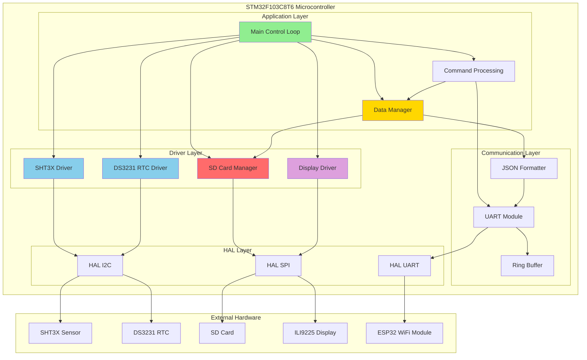
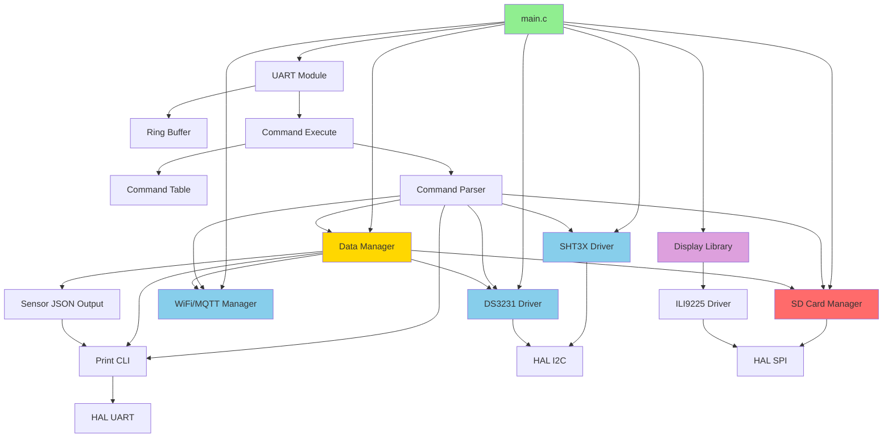
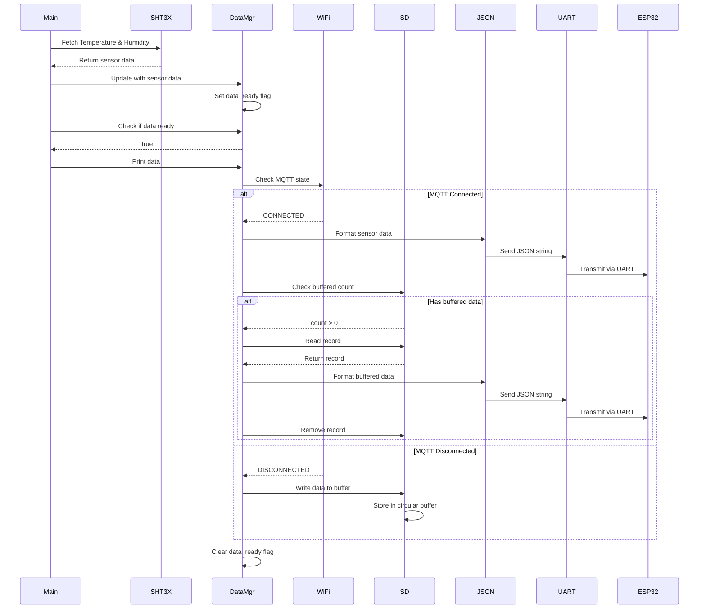
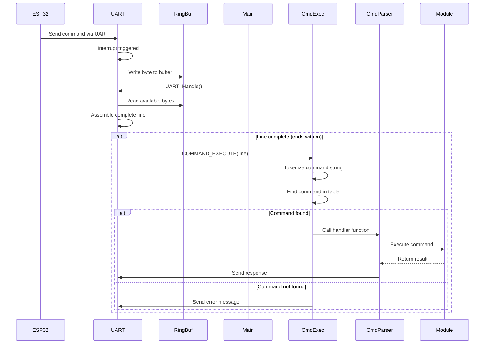
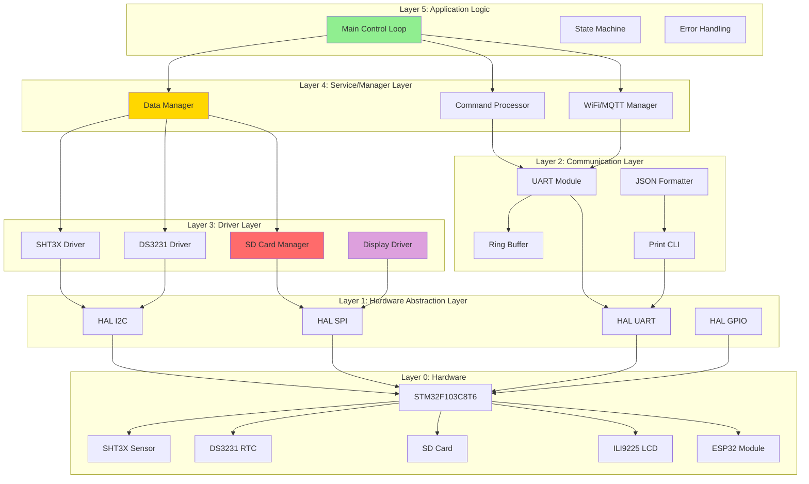
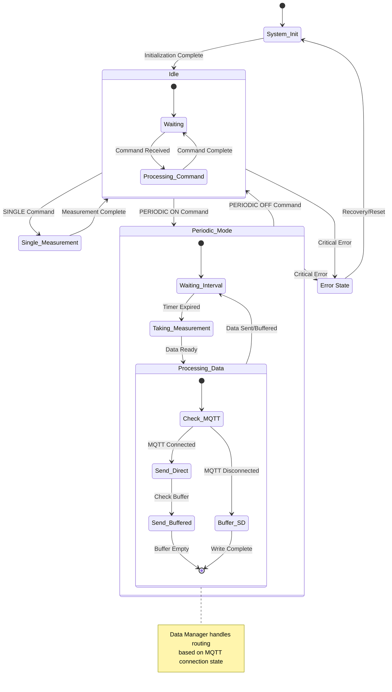
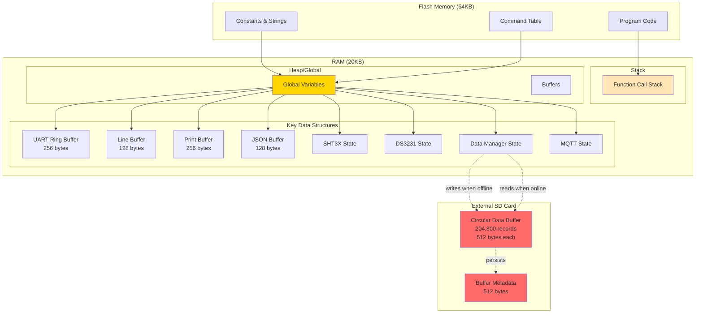
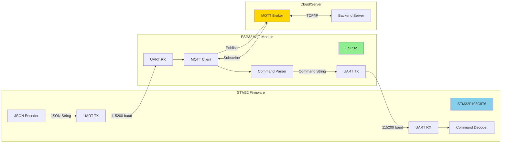
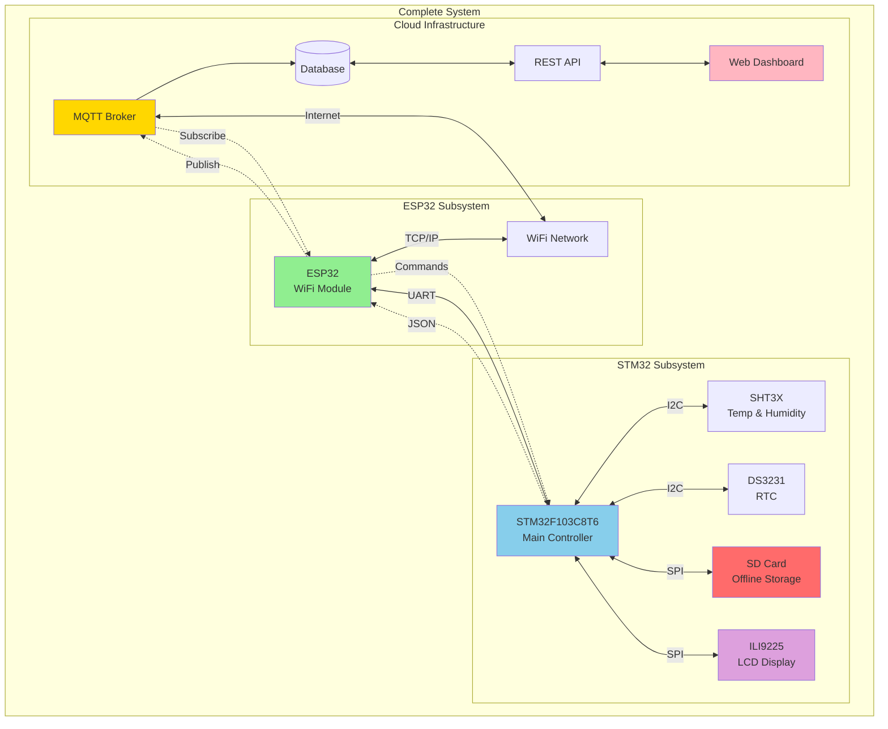

# STM32 Data Logger - Architecture Diagrams

This document provides high-level architecture diagrams showing the system structure, component dependencies, and data flow of the STM32 firmware.

## System Architecture Overview



## Component Dependencies



## Data Flow Architecture

### Normal Operation Data Flow



### Command Processing Data Flow



## Layered Architecture



## State Machine Architecture



## Memory Architecture



## Interrupt and Timing Architecture

```mermaid
graph TB
    subgraph "Interrupt Handlers"
        UART_IRQ[UART RX Interrupt]
        SYSTICK[SysTick Interrupt<br/>1ms]
    end

    subgraph "Main Loop"
        MAIN[Main Loop]
        UART_PROC[UART Processing]
        SENSOR_PROC[Sensor Processing]
        DATA_PROC[Data Processing]
        DISPLAY_PROC[Display Update]
    end

    subgraph "Timing Control"
        HAL_TICK[HAL_GetTick()]
        NEXT_FETCH[next_fetch_ms]
        LAST_FETCH[last_fetch_ms]
        PERIODIC_INT[periodic_interval_ms]
    end

    SYSTICK -->|Increment| HAL_TICK

    UART_IRQ -->|Store byte| UART_BUF[Ring Buffer]

    MAIN --> UART_PROC
    UART_PROC -->|Read| UART_BUF

    MAIN --> SENSOR_PROC
    SENSOR_PROC -->|Check time| HAL_TICK
    SENSOR_PROC -->|Compare| NEXT_FETCH
    SENSOR_PROC -->|Update| LAST_FETCH
    SENSOR_PROC -->|Use interval| PERIODIC_INT

    MAIN --> DATA_PROC
    DATA_PROC -->|Check flag| DATA_READY[data_ready]

    MAIN --> DISPLAY_PROC
    DISPLAY_PROC -->|Check flag| FORCE_UPDATE[force_display_update]

    style UART_IRQ fill:#FF6B6B
    style SYSTICK fill:#FF6B6B
    style MAIN fill:#90EE90
```

## Communication Protocol Architecture



## Data Storage Architecture

```mermaid
graph TB
    subgraph "SD Card Physical Layout"
        BLOCK0[Block 0: Metadata<br/>512 bytes]
        BLOCK1[Block 1: Record 0<br/>512 bytes]
        BLOCK2[Block 2: Record 1<br/>512 bytes]
        BLOCKN[Block N: Record N-1<br/>512 bytes]
        BLOCK_LAST[Block 204800: Record 204799<br/>512 bytes]
    end

    subgraph "Metadata Structure"
        META_WRITE[write_index: uint32_t]
        META_READ[read_index: uint32_t]
        META_COUNT[count: uint32_t]
        META_SEQ[sequence_num: uint32_t]
    end

    subgraph "Data Record Structure"
        REC_TS[timestamp: uint32_t<br/>4 bytes]
        REC_TEMP[temperature: float<br/>4 bytes]
        REC_HUM[humidity: float<br/>4 bytes]
        REC_MODE[mode: char[16]<br/>16 bytes]
        REC_SEQ[sequence_num: uint32_t<br/>4 bytes]
        REC_PAD[padding: uint8_t[480]<br/>480 bytes]
    end

    BLOCK0 --> META_WRITE
    BLOCK0 --> META_READ
    BLOCK0 --> META_COUNT
    BLOCK0 --> META_SEQ

    BLOCK1 --> REC_TS
    BLOCK1 --> REC_TEMP
    BLOCK1 --> REC_HUM
    BLOCK1 --> REC_MODE
    BLOCK1 --> REC_SEQ
    BLOCK1 --> REC_PAD

    BLOCK1 -.->|Circular| BLOCK2
    BLOCK2 -.->|Circular| BLOCKN
    BLOCKN -.->|Circular| BLOCK_LAST
    BLOCK_LAST -.->|Wrap around| BLOCK1

    style BLOCK0 fill:#FFD700
    style BLOCK1 fill:#FF6B6B
    style BLOCK2 fill:#FF6B6B
    style BLOCKN fill:#FF6B6B
    style BLOCK_LAST fill:#FF6B6B
```

## System Integration Architecture



---

## Architecture Principles

### 1. Separation of Concerns

- **Hardware Abstraction**: HAL layer isolates hardware-specific code
- **Driver Layer**: Encapsulates device-specific protocols
- **Service Layer**: Manages application logic and data flow
- **Application Layer**: Coordinates overall system behavior

### 2. Data Flow Patterns

#### Online Mode (MQTT Connected):

```
Sensor → DataManager → JSON Formatter → UART → ESP32 → MQTT Broker
```

#### Offline Mode (MQTT Disconnected):

```
Sensor → DataManager → SD Card Manager → SD Card (Circular Buffer)
```

#### Recovery Mode (MQTT Reconnected):

```
SD Card → SD Card Manager → DataManager → JSON Formatter → UART → ESP32
```

### 3. Key Design Decisions

- **Ring Buffer for UART**: Handles asynchronous command reception without blocking
- **Circular Buffer on SD**: Provides 204,800 record capacity with automatic wraparound
- **State-based MQTT Handling**: Routes data based on connection state
- **Interrupt-driven Communication**: UART RX uses interrupts, main loop polls
- **Persistent Metadata**: SD card metadata survives power cycles

### 4. Resource Constraints

- **Flash**: 64KB (program code, constants, command table)
- **RAM**: 20KB (stack, buffers, state variables)
- **SD Card**: ~100MB usable (204,800 × 512 bytes)
- **I2C Speed**: 100kHz (SHT3X, DS3231)
- **SPI Speed**: 18MHz (SD Card, ILI9225)
- **UART Speed**: 115200 baud (ESP32 communication)

### 5. Timing Constraints

- **SHT3X Measurement**: 15ms (high repeatability)
- **Display Update**: ~100ms (full screen redraw)
- **SD Card Write**: <100ms per record
- **Buffered Data Send**: 100ms spacing between records
- **Periodic Interval**: Configurable (default 60000ms)
