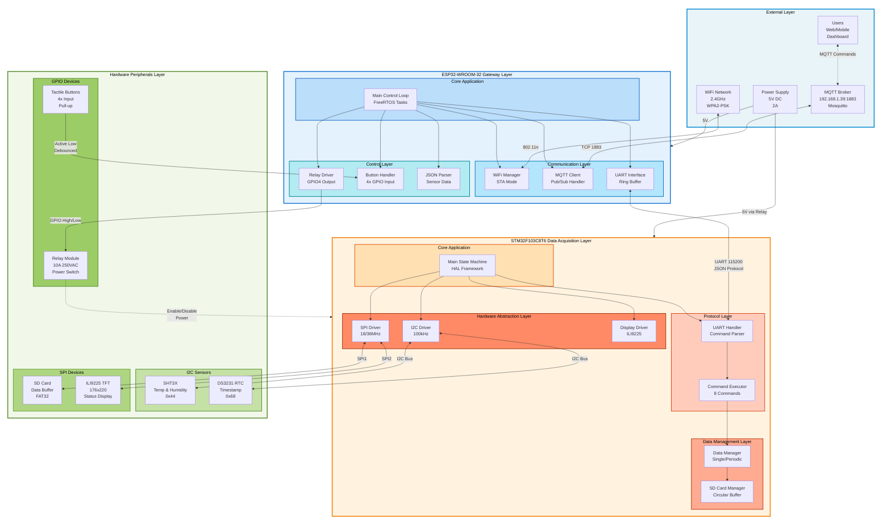
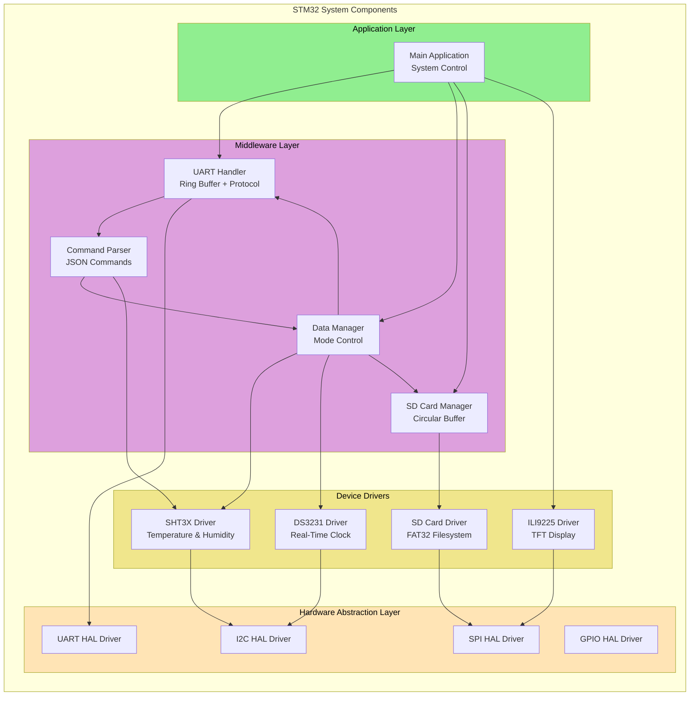
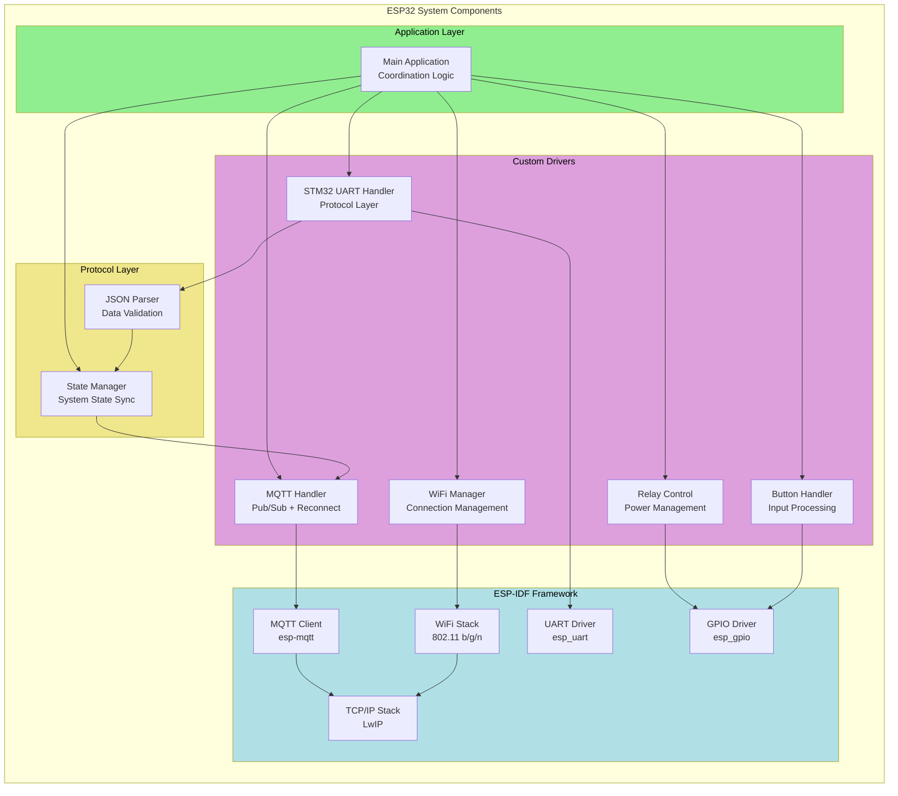
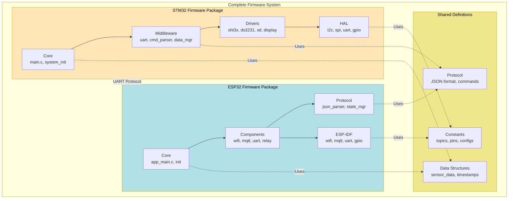
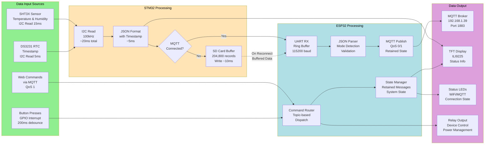
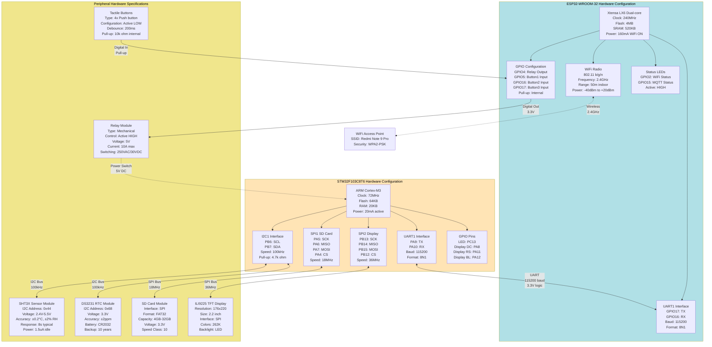
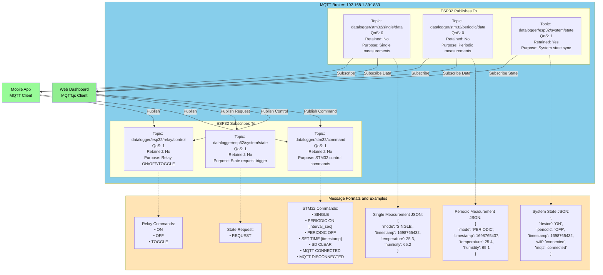
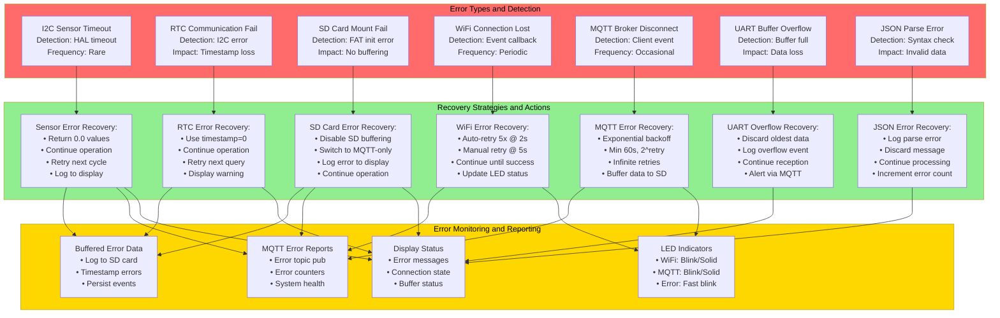
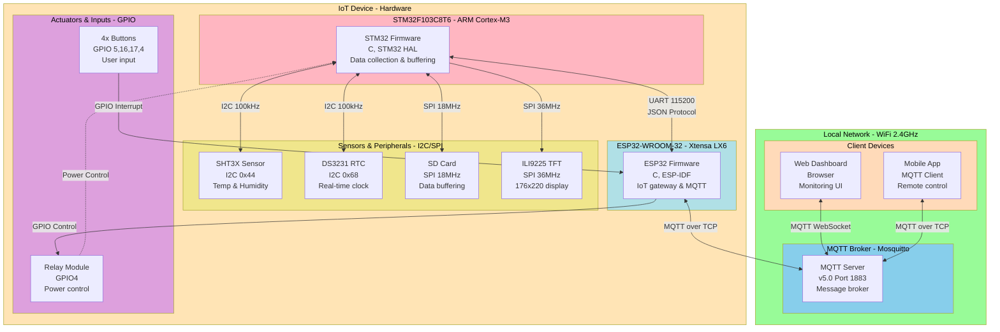

# Firmware System - Architecture Diagrams

This document provides the system architecture, data flow, state machines, and infrastructure diagrams for the ESP32 and STM32 coordination system.

## System Architecture Overview

## Component Diagram - STM32 Modules

## Component Diagram - ESP32 Modules

## Package Diagram - Overall System Structure

## Data Flow Architecture

## Hardware Configuration and Pinout

## MQTT Protocol and Topic Architecture

## Error Handling and Recovery Strategy

## Deployment Diagram

## System Timing and Synchronization Diagram

```mermaid
gantt
    title System Timing and Event Sequence
    dateFormat X
    axisFormat %L ms

    section STM32 Boot
    Power ON              :milestone, 0, 0
    System Init           :0, 500
    I2C Init              :100, 150
    SPI Init              :150, 200
    UART Init             :200, 250
    Sensor Init           :250, 350
    SD Card Mount         :350, 450
    Display Init          :450, 500
    Ready State           :milestone, 500, 500

    section STM32 Single Measure
    Receive SINGLE cmd    :milestone, 600, 600
    SHT3X Measure 15ms    :600, 615
    I2C Read              :615, 620
    RTC Get Time          :620, 625
    Format JSON           :625, 630
    UART Transmit 10ms    :630, 640
    Complete              :milestone, 640, 640

    section ESP32 Boot
    Power ON              :milestone, 0, 0
    System Init           :0, 1000
    FreeRTOS Start        :100, 200
    UART Init             :200, 300
    GPIO Init             :300, 400
    WiFi Init             :400, 500
    WiFi Connect Start    :1000, 1100
    WiFi Connecting       :1100, 11000
    WiFi Connected        :milestone, 11000, 11000
    Wait 4s Stable        :11000, 15000
    MQTT Connect Start    :15000, 15100
    MQTT Connecting       :15100, 17000
    MQTT Connected        :milestone, 17000, 17000

    section ESP32 Process
    UART RX Interrupt     :milestone, 640, 640
    Read from Buffer      :640, 642
    JSON Parse            :642, 645
    Validate Data         :645, 647
    MQTT Publish          :647, 652
    Update State          :652, 655
    Display Update        :655, 660

    section Periodic Mode
    Start Periodic        :milestone, 20000, 20000
    Measure Interval 5s   :20000, 25000
    Next Measure          :25000, 30000
    Next Measure          :30000, 35000
    Next Measure          :35000, 40000

    section Delays Reference
    WiFi Retry 2s         :milestone, 2000
    Manual Retry 5s       :milestone, 5000
    MQTT Backoff 1s       :milestone, 1000
    MQTT Backoff 2s       :milestone, 2000
    MQTT Backoff 4s       :milestone, 4000
    Button Debounce 200ms :milestone, 200
```

## System Performance Characteristics

### Latency and Throughput

- **End-to-End Latency**: <100ms (Sensor → Web)
  - I2C Read: ~20ms
  - JSON Format: ~5ms
  - UART Transfer: ~10ms
  - MQTT Publish: ~30ms
  - Network propagation: ~30ms
- **Measurement Rate**: 0.2 Hz to 1 Hz (5s-60s configurable)
- **UART Throughput**: ~11.5 KB/s (115200 baud, 8N1)
- **SD Write Speed**: ~100 KB/s (18MHz SPI, FAT32)
- **Buffer Capacity**: 204,800 records (~16MB, >14 days @ 5s interval)

### Reliability and Availability

- **MTBF**: >10,000 hours (estimated)
- **Data Integrity**: CRC-16 for sensor data
- **Persistence**: Non-volatile SD card storage
- **Network Uptime**: Auto-reconnect with exponential backoff
- **Power Resilience**: Relay-based power management
- **Clock Accuracy**: ±2ppm (DS3231 with battery backup)

### Power Consumption Profile

| Component        | Active | Idle   | Sleep | Notes           |
| ---------------- | ------ | ------ | ----- | --------------- |
| STM32F103        | 20mA   | 20mA   | N/A   | Always active   |
| ESP32 WiFi ON    | 160mA  | -      | N/A   | TX/RX           |
| ESP32 WiFi OFF   | 80mA   | -      | N/A   | Processing only |
| SHT3X            | 0.3mA  | 1.5μA  | -     | During measure  |
| DS3231           | 0.2mA  | 0.1μA  | -     | Battery backup  |
| SD Card          | 100mA  | 0.2mA  | -     | During write    |
| TFT Display      | 50mA   | 20mA   | -     | Backlight on    |
| **Total System** | ~200mA | ~120mA | N/A   | @ 5V DC         |

### Scalability Considerations

- **Current**: Single device deployment
- **Future**: Multi-device MQTT hierarchy ready
- **Sensor Expansion**: I2C bus supports 127 addresses
- **Storage Scaling**: SD card up to 32GB (FAT32 limit)
- **Network Scaling**: MQTT broker can handle 100+ devices
- **Cloud Integration**: MQTT bridge to AWS IoT/Azure IoT ready

### Security Features

- **Authentication**: MQTT username/password (admin/password)
- **Encryption**: WPA2-PSK for WiFi network
- **Physical Security**: Relay power control for STM32
- **Data Privacy**: Local network only (no internet exposure)
- **Future Enhancements**: TLS/SSL for MQTT, certificate-based auth
