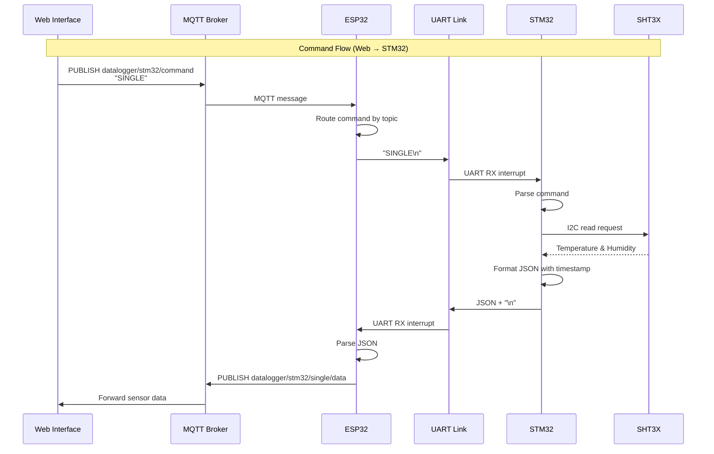
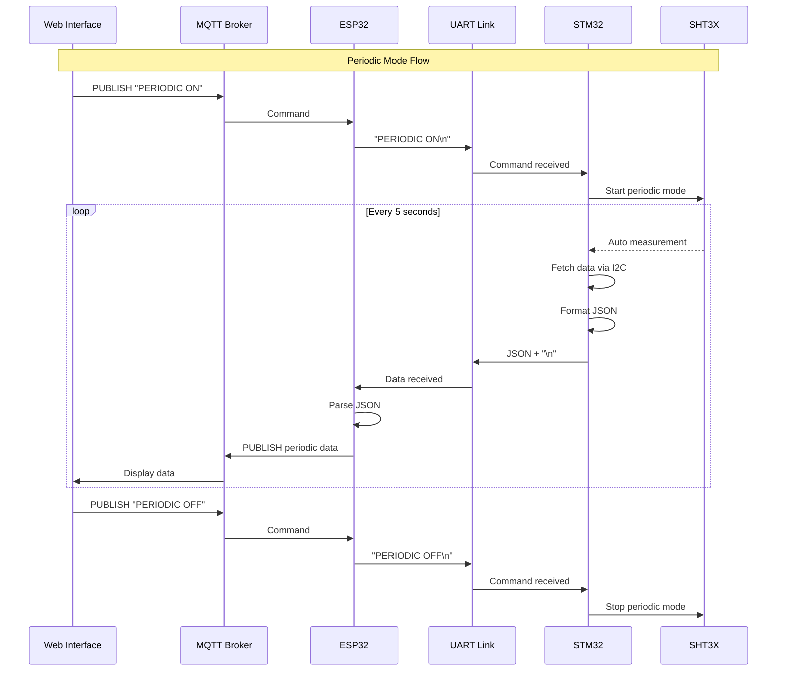
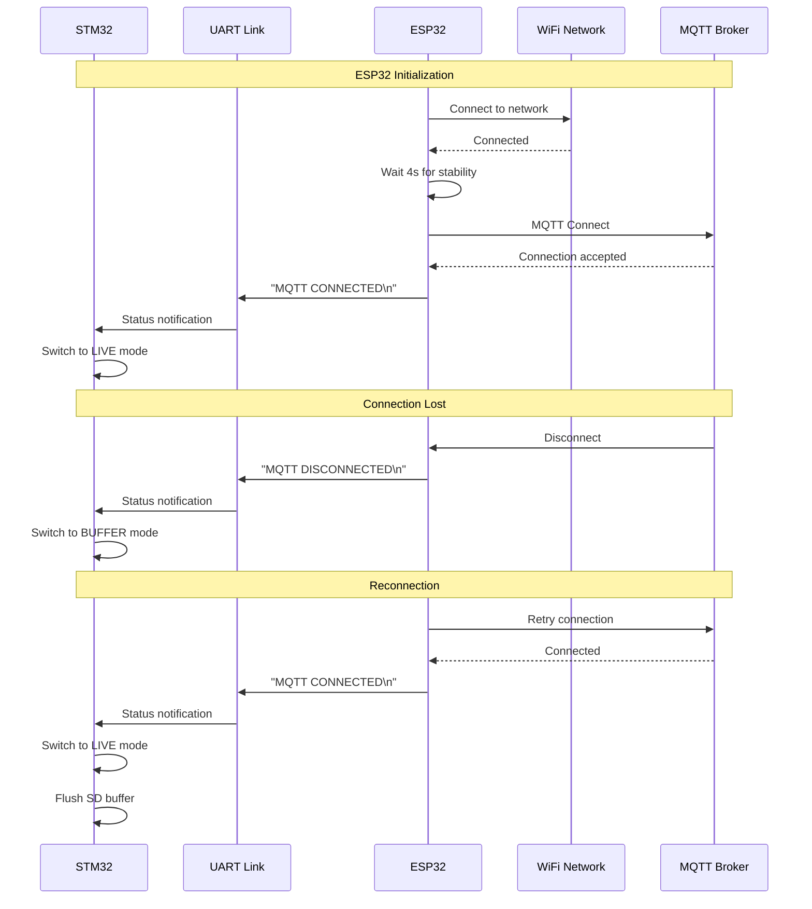
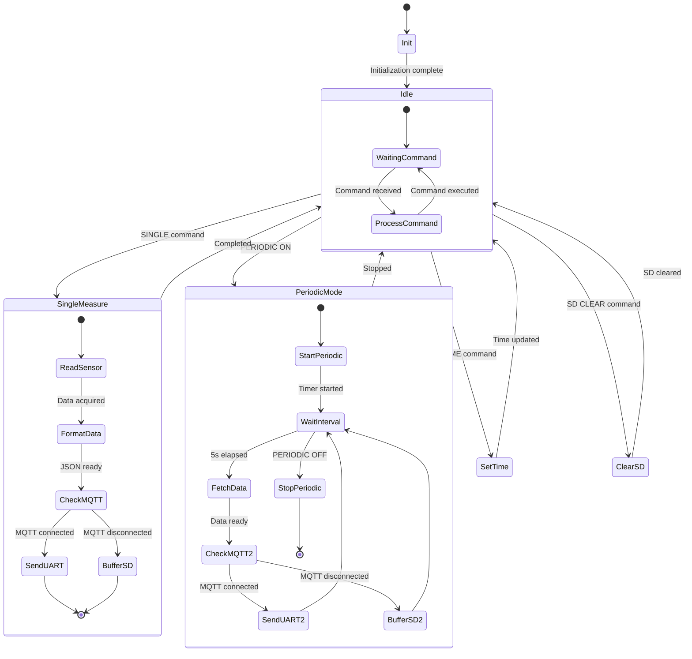
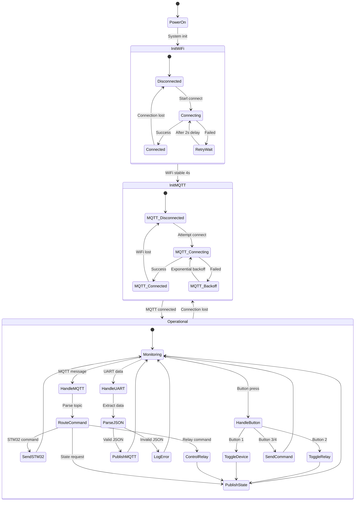
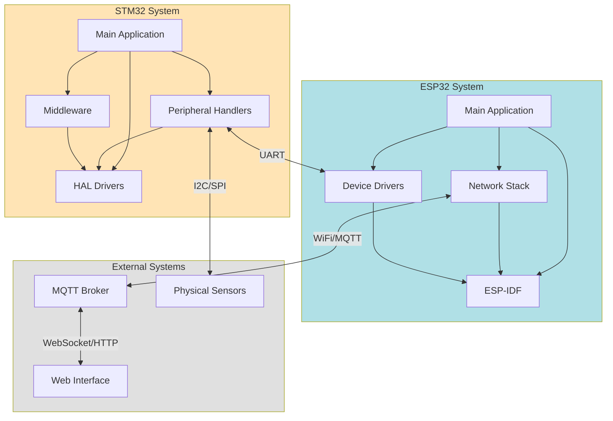
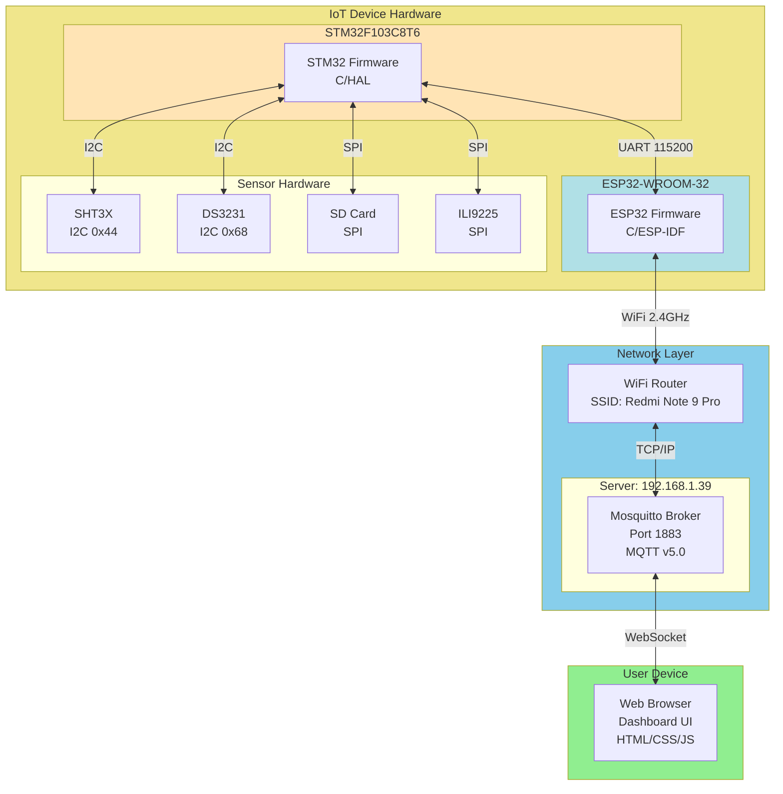
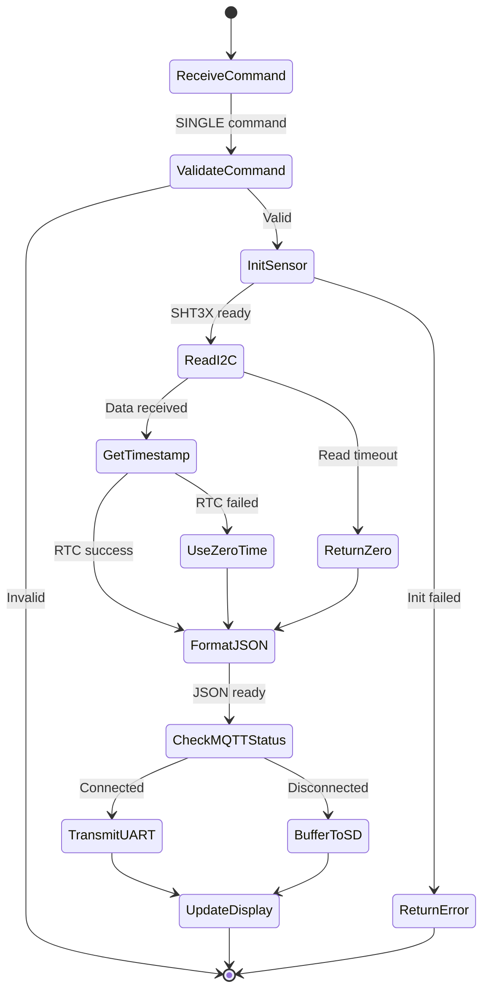
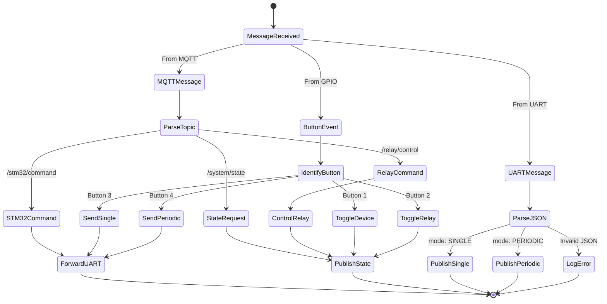

# UML Diagrams - Firmware System

This document contains only UML diagrams for the firmware system.

## 1. Class Diagram - Complete System

```mermaid
classDiagram
    %% STM32 Classes
    class STM32_Main {
        +I2C_HandleTypeDef hi2c1
        +SPI_HandleTypeDef hspi1, hspi2
        +UART_HandleTypeDef huart1
        +sht3x_t g_sht3x
        +ds3231_t g_ds3231
        +mqtt_state_t mqtt_current_state
        +uint32_t periodic_interval_ms
        +main() int
        +SystemClock_Config() void
    }

    class STM32_UART {
        -UART_HandleTypeDef* huart
        -ring_buffer_t rx_buffer
        +UART_Init() void
        +UART_Handle() void
        +UART_RxCallback(uint8_t) void
    }

    class STM32_CommandParser {
        +COMMAND_EXECUTE(char*) void
        +SINGLE_PARSER() void
        +PERIODIC_ON_PARSER() void
        +PERIODIC_OFF_PARSER() void
        +SET_TIME_PARSER() void
        +MQTT_CONNECTED_PARSER() void
        +MQTT_DISCONNECTED_PARSER() void
        +SD_CLEAR_PARSER() void
    }

    class STM32_DataManager {
        -data_manager_state_t state
        -data_manager_mode_t mode
        +DataManager_Init() void
        +DataManager_UpdateSingle(float, float) void
        +DataManager_UpdatePeriodic(float, float) void
        +DataManager_Print() bool
    }

    class STM32_SDCardManager {
        -sd_card_state_t state
        -uint32_t write_pointer
        -uint32_t read_pointer
        -uint32_t record_count
        +SDCardManager_Init() bool
        +SDCardManager_WriteData(char*) bool
        +SDCardManager_ReadData(char*) bool
        +SDCardManager_RemoveRecord() bool
        +SDCardManager_Clear() bool
    }

    class STM32_SHT3X {
        -I2C_HandleTypeDef* hi2c
        -float temperature
        -float humidity
        -sht3x_mode_t currentState
        +SHT3X_Init() void
        +SHT3X_Single() SHT3X_StatusTypeDef
        +SHT3X_Periodic() SHT3X_StatusTypeDef
        +SHT3X_FetchData() SHT3X_StatusTypeDef
        +SHT3X_PeriodicStop() SHT3X_StatusTypeDef
    }

    class STM32_DS3231 {
        -I2C_HandleTypeDef* hi2c
        +DS3231_Init() void
        +DS3231_Set_Time(struct tm*) DS3231_StatusTypeDef
        +DS3231_Get_Time(struct tm*) DS3231_StatusTypeDef
    }

    class STM32_Display {
        +Display_Init() void
        +Display_Update() void
        +Display_ShowSensorData(float, float) void
        +Display_ShowMQTTState(bool) void
        +Display_ShowBufferCount(uint32_t) void
    }

    %% ESP32 Classes
    class ESP32_Main {
        +wifi_manager_t g_wifi_manager
        +stm32_uart_t g_stm32_uart
        +mqtt_handler_t g_mqtt_handler
        +relay_control_t g_relay
        +bool g_device_on
        +bool g_periodic_active
        +app_main() void
        +initialize_components() void
        +update_and_publish_state() void
    }

    class ESP32_WiFiManager {
        -wifi_state_t current_state
        -uint8_t retry_count
        +WiFi_Init() bool
        +WiFi_Connect() bool
        +WiFi_GetState() wifi_state_t
        +WiFi_IsConnected() bool
    }

    class ESP32_MQTT_Handler {
        -esp_mqtt_client_handle_t client
        -bool connected
        -int retry_count
        +MQTT_Handler_Init() bool
        +MQTT_Handler_Start() bool
        +MQTT_Handler_Subscribe() bool
        +MQTT_Handler_Publish() bool
    }

    class ESP32_UART {
        -int uart_num
        -ring_buffer_t rx_buffer
        -stm32_data_callback_t callback
        +STM32_UART_Init() bool
        +STM32_UART_SendCommand() bool
        +STM32_UART_ProcessData() void
    }

    class ESP32_RelayControl {
        -int gpio_num
        -bool state
        -relay_state_callback_t callback
        +Relay_Init() bool
        +Relay_SetState(bool) bool
        +Relay_Toggle() bool
    }

    class ESP32_JSONParser {
        -sensor_data_callback_t single_callback
        -sensor_data_callback_t periodic_callback
        +JSON_Parser_Init() bool
        +JSON_Parser_ProcessLine() bool
        +JSON_Parser_IsValid() bool
    }

    class ESP32_ButtonHandler {
        -gpio_num_t gpio_num
        -button_press_callback_t callback
        +Button_Init() bool
        +Button_StartTask() bool
    }

    %% Relationships
    STM32_Main --> STM32_UART : uses
    STM32_Main --> STM32_SHT3X : uses
    STM32_Main --> STM32_DS3231 : uses
    STM32_Main --> STM32_DataManager : uses
    STM32_Main --> STM32_SDCardManager : uses
    STM32_Main --> STM32_Display : uses
    STM32_UART --> STM32_CommandParser : triggers
    STM32_CommandParser --> STM32_SHT3X : controls
    STM32_CommandParser --> STM32_DataManager : updates
    STM32_DataManager --> STM32_SDCardManager : buffers to

    ESP32_Main --> ESP32_WiFiManager : uses
    ESP32_Main --> ESP32_MQTT_Handler : uses
    ESP32_Main --> ESP32_UART : uses
    ESP32_Main --> ESP32_RelayControl : uses
    ESP32_Main --> ESP32_JSONParser : uses
    ESP32_Main --> ESP32_ButtonHandler : uses

    ESP32_UART -.->|UART Communication| STM32_UART : bidirectional
    ESP32_RelayControl -.->|Power Control| STM32_Main : controls
```

## 2. Sequence Diagram - Command Flow



## 3. Sequence Diagram - Periodic Mode



## 4. Sequence Diagram - MQTT Connection Status



## 5. State Diagram - STM32 Operation



## 6. State Diagram - ESP32 Operation



## 7. Component Diagram



## 8. Deployment Diagram



## 9. Activity Diagram - Single Measurement Flow



## 10. Activity Diagram - ESP32 Message Routing



## Diagram Summary

This document contains **10 UML diagrams**:

1. **Class Diagram** - Complete system classes and relationships
2. **Sequence Diagram** - Command flow from web to sensor
3. **Sequence Diagram** - Periodic mode operation
4. **Sequence Diagram** - MQTT connection management
5. **State Diagram** - STM32 operation states
6. **State Diagram** - ESP32 operation states
7. **Component Diagram** - System components and dependencies
8. **Deployment Diagram** - Physical deployment architecture
9. **Activity Diagram** - Single measurement workflow
10. **Activity Diagram** - ESP32 message routing logic

These diagrams follow standard UML notation and provide comprehensive views of the firmware system architecture.
