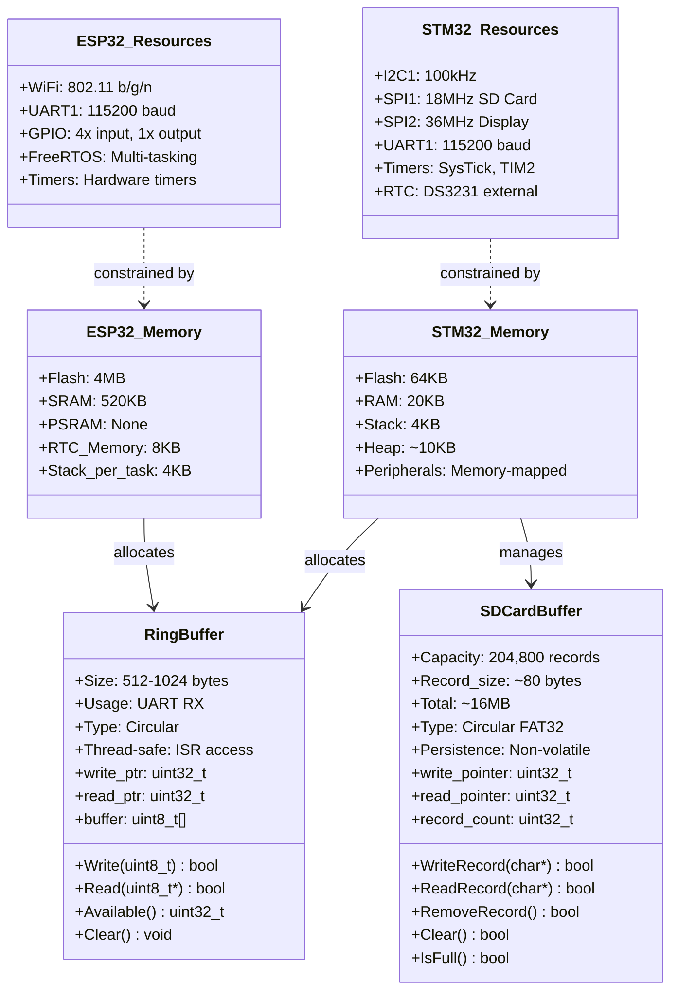
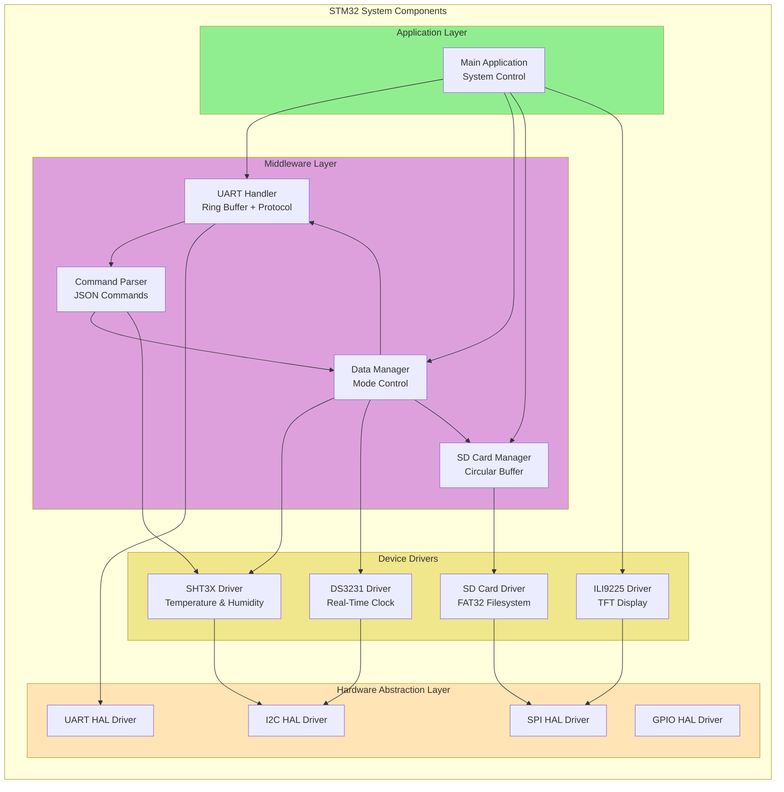
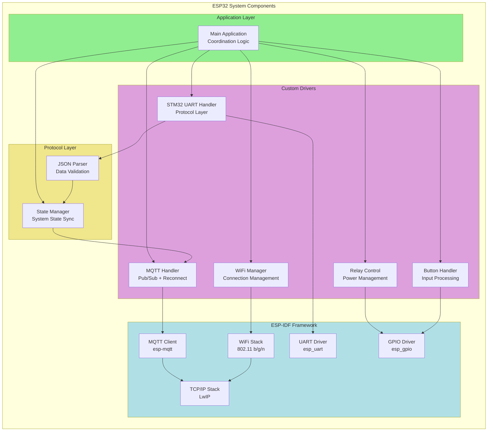
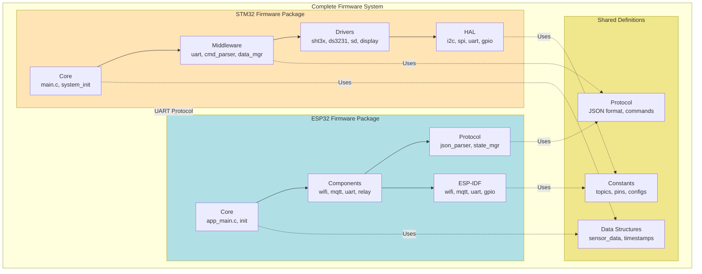

# UML Class Diagrams - Firmware System

This document provides the UML class diagrams and component diagrams for the ESP32 and STM32 firmware system.

## Complete System Class Diagram

```mermaid
classDiagram
    %% STM32 Firmware Classes
    class STM32_Main {
        +I2C_HandleTypeDef hi2c1
        +SPI_HandleTypeDef hspi1, hspi2
        +UART_HandleTypeDef huart1
        +sht3x_t g_sht3x
        +ds3231_t g_ds3231
        +mqtt_state_t mqtt_current_state
        +uint32_t periodic_interval_ms
        +main() int
        +SystemClock_Config() void
    }

    class STM32_UART {
        -UART_HandleTypeDef* huart
        -ring_buffer_t rx_buffer
        +UART_Init() void
        +UART_Handle() void
        +UART_RxCallback(uint8_t) void
    }

    class STM32_CommandParser {
        +COMMAND_EXECUTE(char*) void
        +SINGLE_PARSER() void
        +PERIODIC_ON_PARSER() void
        +PERIODIC_OFF_PARSER() void
        +SET_TIME_PARSER() void
        +MQTT_CONNECTED_PARSER() void
        +MQTT_DISCONNECTED_PARSER() void
        +SD_CLEAR_PARSER() void
    }

    class STM32_DataManager {
        -data_manager_state_t state
        -data_manager_mode_t mode
        +DataManager_Init() void
        +DataManager_UpdateSingle(float, float) void
        +DataManager_UpdatePeriodic(float, float) void
        +DataManager_Print() bool
    }

    class STM32_SDCardManager {
        -sd_card_state_t state
        -uint32_t write_pointer
        -uint32_t read_pointer
        -uint32_t record_count
        +SDCardManager_Init() bool
        +SDCardManager_WriteData(char*) bool
        +SDCardManager_ReadData(char*) bool
        +SDCardManager_RemoveRecord() bool
        +SDCardManager_Clear() bool
    }

    class STM32_SHT3X {
        -I2C_HandleTypeDef* hi2c
        -float temperature
        -float humidity
        -sht3x_mode_t currentState
        +SHT3X_Init() void
        +SHT3X_Single() SHT3X_StatusTypeDef
        +SHT3X_Periodic() SHT3X_StatusTypeDef
        +SHT3X_FetchData() SHT3X_StatusTypeDef
        +SHT3X_PeriodicStop() SHT3X_StatusTypeDef
    }

    class STM32_DS3231 {
        -I2C_HandleTypeDef* hi2c
        +DS3231_Init() void
        +DS3231_Set_Time(struct tm*) DS3231_StatusTypeDef
        +DS3231_Get_Time(struct tm*) DS3231_StatusTypeDef
    }

    class STM32_Display {
        +Display_Init() void
        +Display_Update() void
        +Display_ShowSensorData(float, float) void
        +Display_ShowMQTTState(bool) void
        +Display_ShowBufferCount(uint32_t) void
    }

    %% ESP32 Firmware Classes
    class ESP32_Main {
        +wifi_manager_t g_wifi_manager
        +stm32_uart_t g_stm32_uart
        +mqtt_handler_t g_mqtt_handler
        +relay_control_t g_relay
        +bool g_device_on
        +bool g_periodic_active
        +app_main() void
        +initialize_components() void
        +update_and_publish_state() void
    }

    class ESP32_WiFiManager {
        -wifi_state_t current_state
        -uint8_t retry_count
        +WiFi_Init() bool
        +WiFi_Connect() bool
        +WiFi_GetState() wifi_state_t
        +WiFi_IsConnected() bool
    }

    class ESP32_MQTT_Handler {
        -esp_mqtt_client_handle_t client
        -bool connected
        -int retry_count
        +MQTT_Handler_Init() bool
        +MQTT_Handler_Start() bool
        +MQTT_Handler_Subscribe() bool
        +MQTT_Handler_Publish() bool
    }

    class ESP32_UART {
        -int uart_num
        -ring_buffer_t rx_buffer
        -stm32_data_callback_t callback
        +STM32_UART_Init() bool
        +STM32_UART_SendCommand() bool
        +STM32_UART_ProcessData() void
    }

    class ESP32_RelayControl {
        -int gpio_num
        -bool state
        -relay_state_callback_t callback
        +Relay_Init() bool
        +Relay_SetState(bool) bool
        +Relay_Toggle() bool
    }

    class ESP32_JSONParser {
        -sensor_data_callback_t single_callback
        -sensor_data_callback_t periodic_callback
        +JSON_Parser_Init() bool
        +JSON_Parser_ProcessLine() bool
        +JSON_Parser_IsValid() bool
    }

    class ESP32_ButtonHandler {
        -gpio_num_t gpio_num
        -button_press_callback_t callback
        +Button_Init() bool
        +Button_StartTask() bool
    }

    %% Relationships
    STM32_Main --> STM32_UART : uses
    STM32_Main --> STM32_SHT3X : uses
    STM32_Main --> STM32_DS3231 : uses
    STM32_Main --> STM32_DataManager : uses
    STM32_Main --> STM32_SDCardManager : uses
    STM32_Main --> STM32_Display : uses
    STM32_UART --> STM32_CommandParser : triggers
    STM32_CommandParser --> STM32_SHT3X : controls
    STM32_CommandParser --> STM32_DataManager : updates
    STM32_DataManager --> STM32_SDCardManager : buffers to

    ESP32_Main --> ESP32_WiFiManager : uses
    ESP32_Main --> ESP32_MQTT_Handler : uses
    ESP32_Main --> ESP32_UART : uses
    ESP32_Main --> ESP32_RelayControl : uses
    ESP32_Main --> ESP32_JSONParser : uses
    ESP32_Main --> ESP32_ButtonHandler : uses

    ESP32_UART -.->|UART Communication| STM32_UART : bidirectional
    ESP32_RelayControl -.->|Power Control| STM32_Main : controls
```

## Memory and Resource Management Class Diagram



## Component Diagram - STM32 Modules



## Component Diagram - ESP32 Modules



## Deployment Diagram

```mermaid
C4Deployment
    title Firmware Deployment Diagram - ESP32 and STM32 Coordination

    Deployment_Node(device, "IoT Device", "Hardware"){
        Deployment_Node(stm32, "STM32F103C8T6", "ARM Cortex-M3 Microcontroller"){
            Container(stm32_fw, "STM32 Firmware", "C, STM32 HAL", "Data collection, buffering, and local control")
        }

        Deployment_Node(esp32, "ESP32-WROOM-32", "Xtensa LX6 WiFi Module"){
            Container(esp32_fw, "ESP32 Firmware", "C, ESP-IDF", "IoT gateway, MQTT client, and coordination")
        }

        Deployment_Node(sensors, "Sensors & Peripherals", "I2C/SPI Hardware"){
            Container(sht3x, "SHT3X Sensor", "I2C 0x44", "Temperature & Humidity measurement")
            Container(rtc, "DS3231 RTC", "I2C 0x68", "Real-time clock with battery backup")
            Container(sd, "SD Card", "SPI 18MHz", "Non-volatile data buffering")
            Container(display, "ILI9225 TFT", "SPI 36MHz", "Status display 176x220")
        }

        Deployment_Node(actuators, "Actuators & Inputs", "GPIO Hardware"){
            Container(relay, "Relay Module", "GPIO4", "Power control for STM32")
            Container(buttons, "4x Buttons", "GPIO 5,16,17,4", "User input interface")
        }
    }

    Deployment_Node(network, "Local Network", "WiFi 2.4GHz"){
        Deployment_Node(broker, "MQTT Broker", "Mosquitto Server"){
            Container(mqtt, "MQTT Server", "v5.0 Port 1883", "Message broker and persistence")
        }

        Deployment_Node(clients, "Client Devices", "Web/Mobile"){
            Container(web, "Web Dashboard", "Browser", "Monitoring and control interface")
            Container(mobile, "Mobile App", "MQTT Client", "Remote monitoring")
        }
    }

    Rel(stm32_fw, esp32_fw, "UART 115200 baud", "JSON Protocol")
    Rel(stm32_fw, sht3x, "I2C 100kHz", "Read sensor data")
    Rel(stm32_fw, rtc, "I2C 100kHz", "Get/Set timestamp")
    Rel(stm32_fw, sd, "SPI 18MHz", "Write/Read buffer")
    Rel(stm32_fw, display, "SPI 36MHz", "Update display")

    Rel(esp32_fw, mqtt, "MQTT over TCP", "Pub/Sub messages")
    Rel(esp32_fw, relay, "GPIO Control", "Power ON/OFF")
    Rel(buttons, esp32_fw, "GPIO Interrupt", "Button events")

    Rel(web, mqtt, "MQTT WebSocket", "Commands & Data")
    Rel(mobile, mqtt, "MQTT over TCP", "Commands & Data")

    Rel(relay, stm32, "Power Control", "Enable/Disable")

    UpdateLayoutConfig($c4ShapeInRow="3", $c4BoundaryInRow="2")
```

## Package Diagram - Overall System Structure



---

## Class Details and Specifications

### STM32 Key Classes

**STM32_DataManager**

- Manages sensor data collection modes (SINGLE/PERIODIC)
- Coordinates between sensor reading and data output
- Handles buffering logic based on MQTT connection state

**STM32_SDCardManager**

- Implements circular buffer on SD card using FAT32
- Capacity: 204,800 records (~16MB)
- Pointer-based read/write management
- Persistence across power cycles

**STM32_CommandParser**

- Parses JSON commands from ESP32
- Routes commands to appropriate handlers
- Validates command format and parameters

### ESP32 Key Classes

**ESP32_MQTT_Handler**

- Manages MQTT connection with exponential backoff
- Publishes sensor data to appropriate topics
- Subscribes to command topics
- QoS management (0 for data, 1 for commands)

**ESP32_WiFiManager**

- Handles WiFi connection and reconnection
- Auto-retry with configurable intervals
- State tracking and reporting

**ESP32_JSONParser**

- Validates and parses JSON data from STM32
- Extracts mode, timestamp, temperature, humidity
- Callbacks for single/periodic data

### Memory Classes

**RingBuffer**

- Thread-safe circular buffer for UART RX
- Used by both STM32 and ESP32
- ISR-safe implementation
- Typical size: 512-1024 bytes

**SDCardBuffer**

- Large persistent circular buffer
- Non-volatile storage for offline operation
- Manages 204,800 records with metadata
- Automatic wraparound when full
