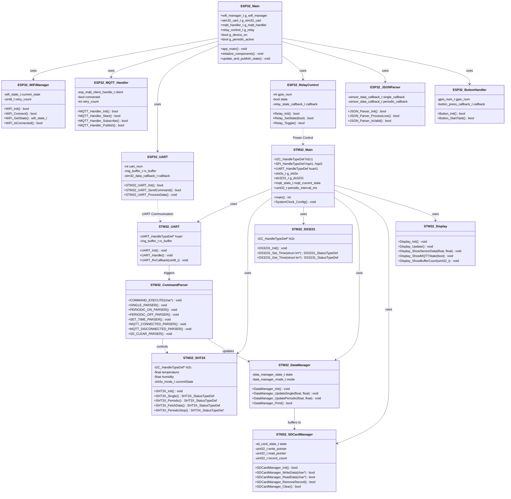
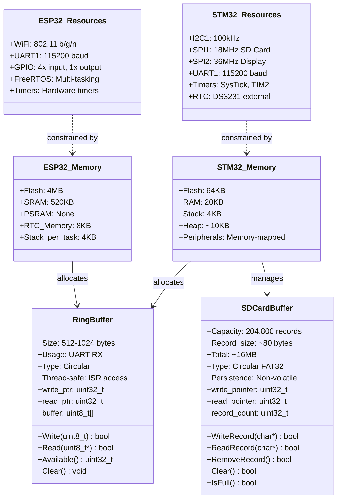
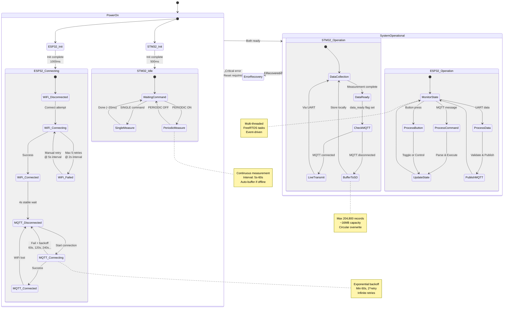
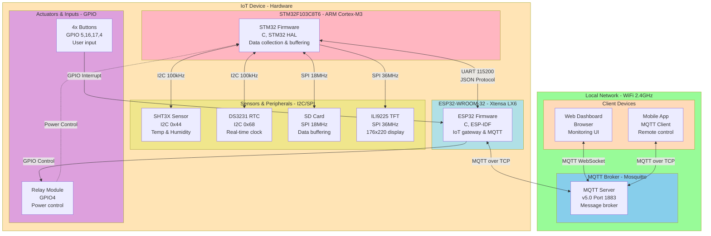

# Firmware System - UML Class Diagrams

This document provides the UML class diagrams and component diagrams for the ESP32 and STM32 firmware system.

## System Class Diagram

## Memory and Resource Management Class Diagram

## State Machine - System Lifecycle

## Deployment Diagram

## Class Details and Specifications

### STM32 Key Classes

**STM32_DataManager**

- Manages sensor data collection modes (SINGLE/PERIODIC)
- Coordinates between sensor reading and data output
- Handles buffering logic based on MQTT connection state

**STM32_SDCardManager**

- Implements circular buffer on SD card using FAT32
- Capacity: 204,800 records (~16MB)
- Pointer-based read/write management
- Persistence across power cycles

**STM32_CommandParser**

- Parses JSON commands from ESP32
- Routes commands to appropriate handlers
- Validates command format and parameters

### ESP32 Key Classes

**ESP32_MQTT_Handler**

- Manages MQTT connection with exponential backoff
- Publishes sensor data to appropriate topics
- Subscribes to command topics
- QoS management (0 for data, 1 for commands)

**ESP32_WiFiManager**

- Handles WiFi connection and reconnection
- Auto-retry with configurable intervals
- State tracking and reporting

**ESP32_JSONParser**

- Validates and parses JSON data from STM32
- Extracts mode, timestamp, temperature, humidity
- Callbacks for single/periodic data

### Memory Classes

**RingBuffer**

- Thread-safe circular buffer for UART RX
- Used by both STM32 and ESP32
- ISR-safe implementation
- Typical size: 512-1024 bytes

**SDCardBuffer**

- Large persistent circular buffer
- Non-volatile storage for offline operation
- Manages 204,800 records with metadata
- Automatic wraparound when full
