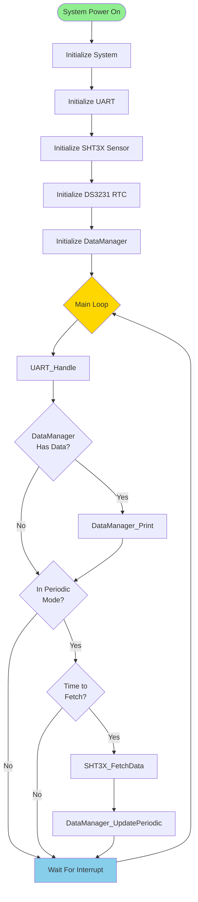
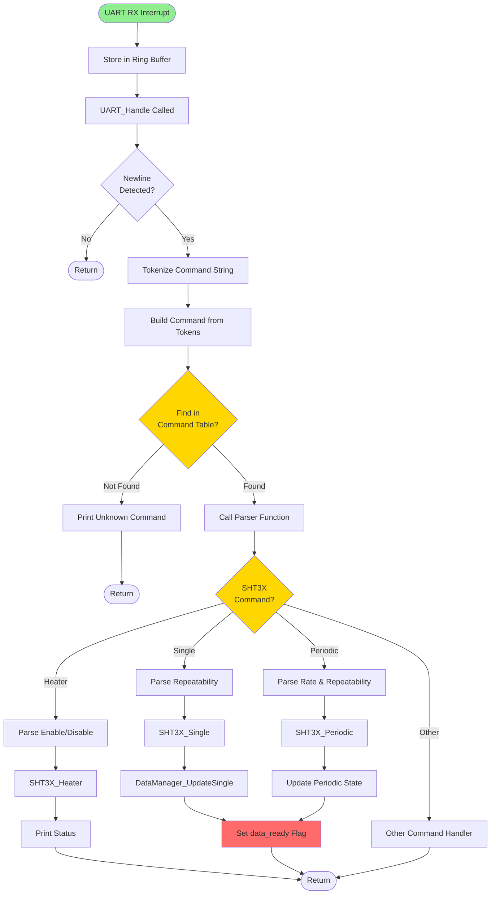
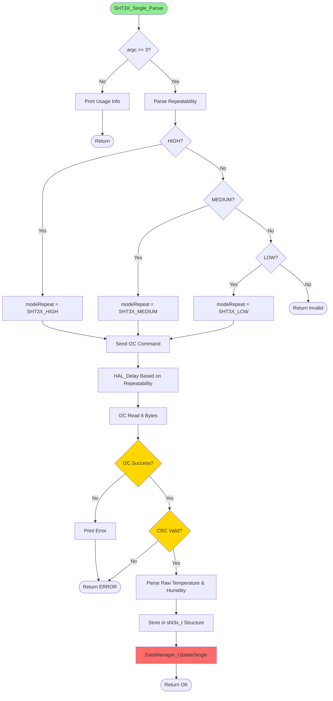
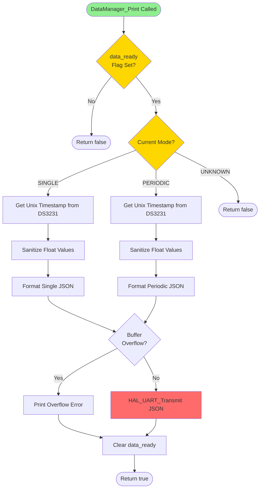
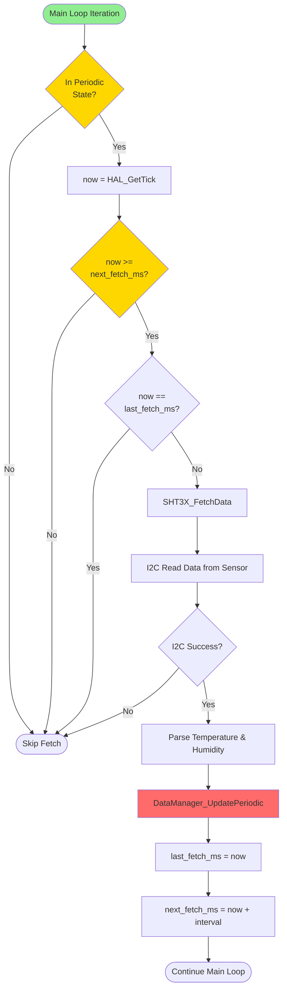
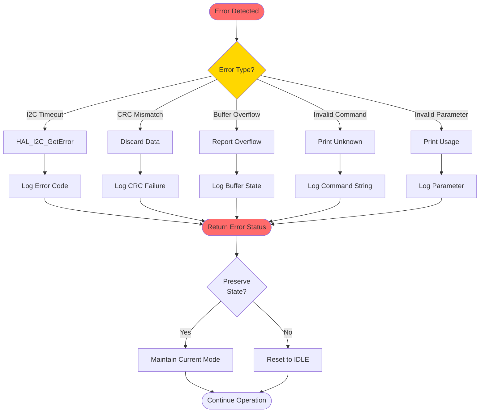
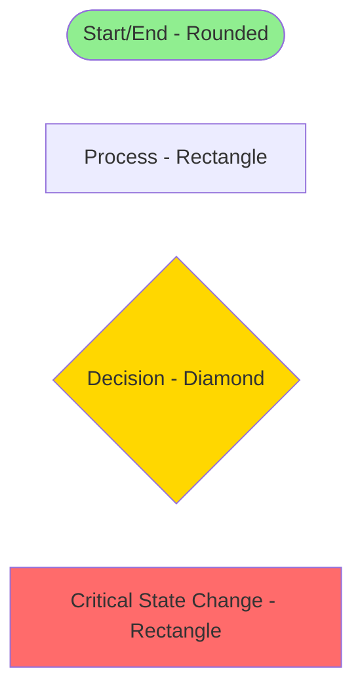

# STM32 Data Logger - Flow Diagram

This document describes the control flow and decision logic within the STM32 firmware.

## Main Application Flow



## Command Execution Flow



## SHT3X Single Measurement Flow



## SHT3X Periodic Measurement Flow

```mermaid
flowchart TD
    Start([SHT3X_Periodic_Parser]) --> CheckStop{argv[2] ==\nSTOP?}
    CheckStop -->|Yes| StopCmd[Send Stop Command]
    CheckStop -->|No| ValidateArgs{argc >= 4?}
    
    StopCmd --> ResetState[currentState = SHT3X_IDLE]
    ResetState --> PrintStop[Print Stop Success]
    PrintStop --> Return1([Return])
    
    ValidateArgs -->|No| PrintUsage[Print Usage]
    ValidateArgs -->|Yes| ParseRate[Parse Rate: 0.5/1/2/4/10]
    PrintUsage --> Return2([Return])
    
    ParseRate --> ParseRepeat[Parse Repeatability: HIGH/MEDIUM/LOW]
    ParseRepeat --> BuildI2C[Build I2C Command Word]
    BuildI2C --> SendI2C[Send I2C Periodic Start]
    SendI2C --> CheckI2C{I2C Success?}
    
    CheckI2C -->|No| PrintError[Print Error]
    CheckI2C -->|Yes| UpdateState[Update currentState]
    PrintError --> Return3([Return ERROR])
    
    UpdateState --> InitTiming[Initialize next_fetch_ms]
    InitTiming --> FirstFetch[SHT3X_FetchData]
    FirstFetch --> CheckFetch{Fetch Success?}
    
    CheckFetch -->|No| Return4([Return ERROR])
    CheckFetch -->|Yes| UpdateDM[DataManager_UpdatePeriodic]
    UpdateDM --> Return5([Return OK])
    
    style Start fill:#90EE90
    style CheckStop fill:#FFD700
    style CheckI2C fill:#FFD700
    style UpdateDM fill:#FF6B6B
```

## Data Manager Print Decision Flow



## Periodic Data Fetch Decision Flow



## Error Handling Flow



## Legend



---

**Notes:**
- Green nodes: Entry/exit points
- Yellow nodes: Decision points
- Red nodes: State changes or critical operations
- Blue nodes: Wait states or returns
- All flows are non-blocking except I2C operations and delays
