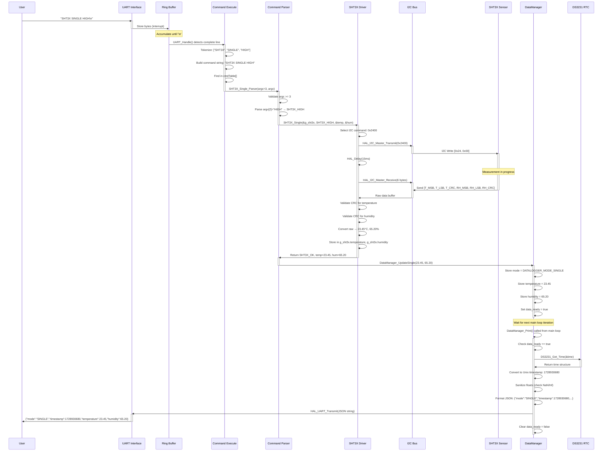
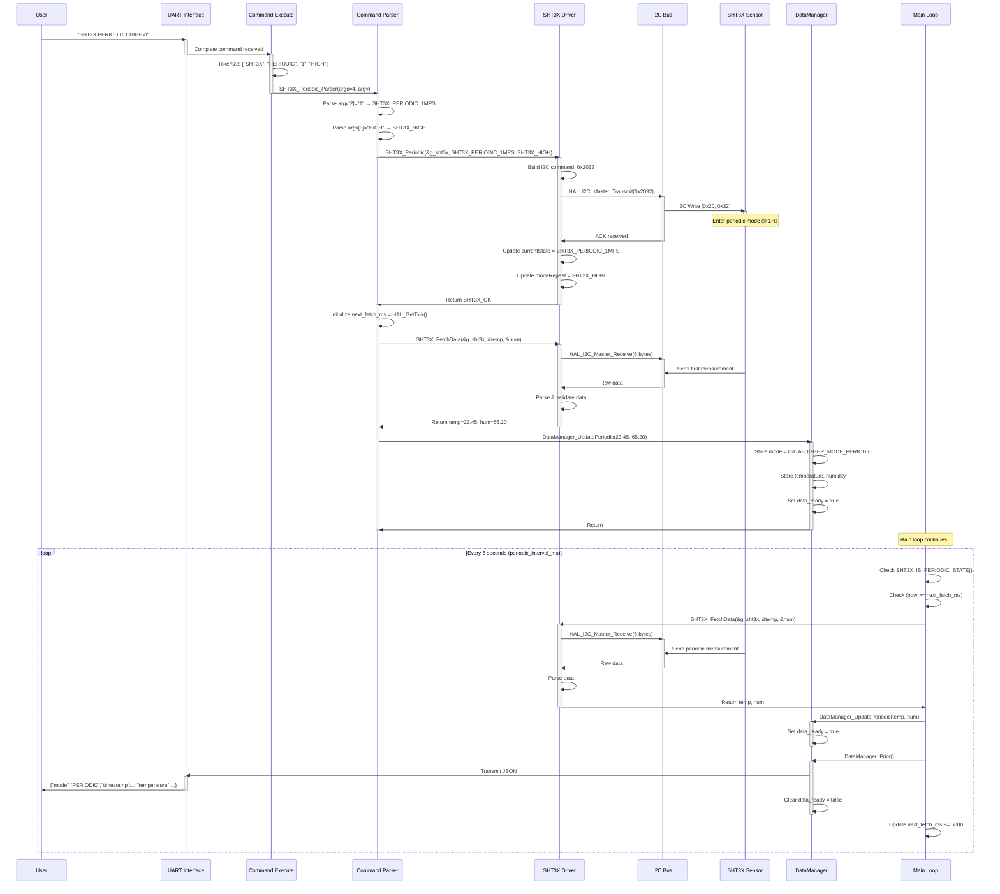
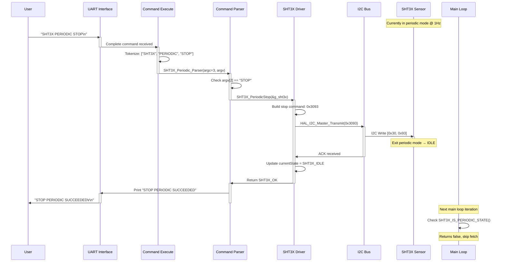
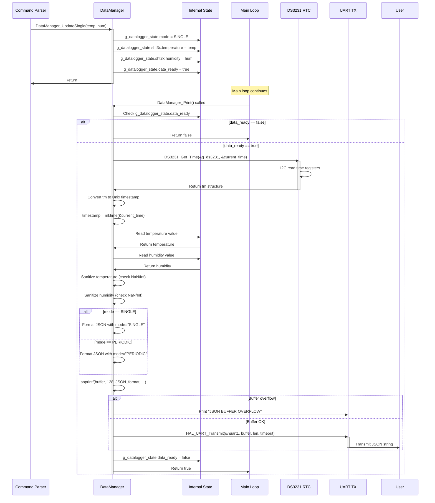
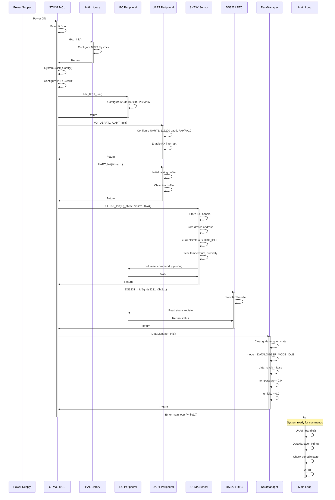

# STM32 Data Logger - Sequence Diagrams

This document illustrates the time-ordered interactions between components in the STM32 firmware.

## Single Shot Measurement Sequence



## Periodic Measurement Setup Sequence



## Periodic Measurement Stop Sequence



## UART Interrupt to Command Dispatch Sequence

```mermaid
sequenceDiagram
    participant HW as UART Hardware
    participant ISR as UART ISR
    participant RingBuf as Ring Buffer
    participant MainLoop as Main Loop
    participant CmdExec as Command Execute
    participant CmdTable as Command Table
    participant Parser as Parser Function
    
    HW->>ISR: Byte received interrupt
    activate ISR
    ISR->>RingBuf: RingBuffer_Write(byte)
    activate RingBuf
    RingBuf->>RingBuf: buf[head] = byte
    RingBuf->>RingBuf: head = (head + 1) % size
    RingBuf->>ISR: Return
    deactivate RingBuf
    ISR->>HW: Re-enable interrupt
    deactivate ISR
    
    Note over MainLoop: Main loop iteration
    MainLoop->>MainLoop: UART_Handle() called
    activate MainLoop
    
    loop Until no complete line
        MainLoop->>RingBuf: RingBuffer_Available()
        activate RingBuf
        RingBuf->>MainLoop: bytes available
        deactivate RingBuf
        
        MainLoop->>RingBuf: RingBuffer_Peek()
        activate RingBuf
        RingBuf->>MainLoop: byte value
        deactivate RingBuf
        
        alt Is newline character
            MainLoop->>MainLoop: Line complete, null terminate
            MainLoop->>CmdExec: COMMAND_EXECUTE(line_buffer)
            activate CmdExec
            
            CmdExec->>CmdExec: Tokenize command string
            CmdExec->>CmdExec: Build command from tokens
            
            CmdExec->>CmdTable: Find matching command
            activate CmdTable
            CmdTable->>CmdTable: Iterate through cmdTable[]
            CmdTable->>CmdTable: Compare command strings
            
            alt Command found
                CmdTable->>CmdExec: Return function pointer
                deactivate CmdTable
                CmdExec->>Parser: cmdTable[i].func(argc, argv)
                activate Parser
                Parser->>Parser: Execute command logic
                Parser->>CmdExec: Return
                deactivate Parser
            else Command not found
                CmdTable->>CmdExec: Return NULL
                deactivate CmdTable
                CmdExec->>Parser: Cmd_Default(argc, argv)
                activate Parser
                Parser->>UART: Print "UNKNOWN COMMAND"
                deactivate Parser
            end
            
            CmdExec->>MainLoop: Return
            deactivate CmdExec
            MainLoop->>MainLoop: Clear line buffer
        else Not newline
            MainLoop->>MainLoop: Append to line buffer
            MainLoop->>RingBuf: RingBuffer_Read()
        end
    end
    
    deactivate MainLoop
```

## DataManager State Update and Print Sequence



## I2C Communication Error Recovery Sequence

```mermaid
sequenceDiagram
    participant Driver as SHT3X Driver
    participant HAL as HAL I2C
    participant I2C as I2C Hardware
    participant Sensor as SHT3X Sensor
    participant Parser as Command Parser
    participant UART
    
    Driver->>HAL: HAL_I2C_Master_Transmit(&hi2c1, addr, data, size, 100)
    activate HAL
    HAL->>I2C: Configure and start I2C transfer
    activate I2C
    I2C->>Sensor: Send START + ADDRESS + DATA
    
    alt Normal operation
        activate Sensor
        Sensor->>I2C: ACK
        deactivate Sensor
        I2C->>HAL: Transfer complete
        deactivate I2C
        HAL->>Driver: Return HAL_OK
        deactivate HAL
        Driver->>Driver: Continue operation
        
    else Timeout (no response)
        Note over Sensor: Sensor not responding
        I2C->>I2C: Wait for timeout (100ms)
        I2C->>HAL: Return HAL_TIMEOUT
        deactivate I2C
        HAL->>Driver: Return HAL_TIMEOUT
        deactivate HAL
        
        Driver->>Driver: Check return status
        Driver->>Driver: Log error
        Driver->>Parser: Return SHT3X_ERROR
        Parser->>UART: Print "SHT3X SINGLE MODE FAILED"
        Parser->>Parser: Preserve previous state
        
    else NACK received
        Sensor->>I2C: NACK (busy/error)
        I2C->>HAL: Return HAL_ERROR
        deactivate I2C
        HAL->>Driver: Return HAL_ERROR
        deactivate HAL
        
        Driver->>Driver: Check return status
        Driver->>HAL: HAL_I2C_GetError(&hi2c1)
        HAL->>Driver: Return error code
        Driver->>Parser: Return SHT3X_ERROR
        Parser->>UART: Print error message
        
    else CRC mismatch
        Sensor->>I2C: Send data with incorrect CRC
        I2C->>HAL: Transfer complete
        deactivate I2C
        HAL->>Driver: Return HAL_OK
        deactivate HAL
        
        Driver->>Driver: Read data buffer
        Driver->>Driver: Calculate CRC on received data
        Driver->>Driver: Compare calculated vs received CRC
        
        alt CRC mismatch detected
            Driver->>Driver: Log CRC error
            Driver->>Parser: Return SHT3X_ERROR
            Parser->>UART: Print "CRC VALIDATION FAILED"
        end
    end
```

## System Initialization Sequence



---

**Key Points:**
- Sequences show time-ordered interactions between components
- Activation bars indicate when a component is active/processing
- Loops represent periodic or repeated operations
- Alt blocks show conditional execution paths
- Notes provide additional context
